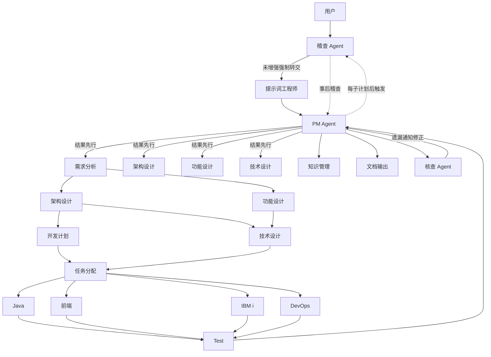

# Agent 角色定义

---

## 1. Agent 角色表

| Agent | 职责 | 上游 | 下游 |
|-------|------|------|------|
| 提示词工程师 Agent | 对原始请求做提示词增强、消歧、注入上下文，确认后传给 PM | 用户 | PM Agent |
| PM Agent | 统筹项目全生命周期，"结果先行"。**对结果蓝图的完整性负总责，确保蓝图覆盖全量细节、无缺漏、无维度间不一致** | 提示词工程师 | 需求/架构/功能/技术设计 Agent、知识管理 Agent |
| 需求分析 Agent | 分析澄清需求，**产出覆盖所有功能和非功能需求的完整需求终态** | PM | 架构/功能设计 |
| 架构设计 Agent | 系统整体架构，**产出覆盖所有模块/组件/部署的完整架构终态** | 需求分析 | 技术设计、开发计划 |
| 功能设计 Agent | 需求转功能模块，**产出覆盖每一页面/交互/字段的完整功能终态** | 需求分析 | 技术设计 |
| 技术设计 Agent | 功能转技术方案，**产出覆盖所有API/数据表/处理链路的完整技术终态** | 架构/功能设计 | 开发计划、代码开发 |
| 开发计划 Agent | 排期与里程碑、子计划执行依赖排序 | 架构/技术设计 | 任务分配 |
| 任务分配 Agent | 拆解任务分配给技术栈 Agent，**按独立子计划文件分配** | 开发计划/技术设计 | Java/前端/IBM i/DevOps |
| Java 开发 Agent | 企业级 Java 实现 | 任务分配 | 测试 |
| 前端开发 Agent | 企业级前端实现 | 任务分配 | 测试 |
| DevOps Agent | CI/CD 流程、GitHub Actions、部署自动化 | 任务分配 | 测试 |
| IBM i 开发 Agent | RPGLE/CLLE/DDS/SQL 实现 | 任务分配 | 测试 |
| 测试 Agent | 测试方案、用例、质量与安全验证 | 各开发 Agent | PM |
| 知识管理 Agent | 收集/总结/归纳信息，维护知识库 | PM | — |
| 文档输出 Agent | Markdown 转 Word/PDF/Excel/PPT | PM | — |
| Custom Agent Foundry Agent | 设计/创建自定义 Agent | 提示词工程师/PM | Skill Creator |
| Skill Creator Agent | 设计/创建 Skill | 提示词工程师/PM | — |
| **核查 Agent** | **内容完整性核查：蓝图→子计划覆盖核查、子计划→产出逐行核查** | **PM Agent** | **PM Agent（通知修正）** |
| 稽查 Agent | 入口拦截 + 全流程合规监察 | 用户（所有入口）、PM Agent | 提示词工程师（强制前置）、所有 Agent（整改要求） |

---

## 2. 协作图

![Agent协作图](https://mermaid.ink/img/Zmxvd2NoYXJ0IFRECiAgICBVc2VyW+eUqOaIt10gLS0+IEF1ZGl0W+eoveafpSBBZ2VudF0KICAgIEF1ZGl0IC0tPnzmnKrlop7lvLrlvLrliLbovazkuqR8IFBFW+aPkOekuuivjeW3peeoi+W4iF0KICAgIFBFIC0tPiBQTVtQTSBBZ2VudF0KICAgIFBNIC0tPnznu5PmnpzlhYjooYx8IFJBW+mcgOaxguWIhuaekF0KICAgIFBNIC0tPnznu5PmnpzlhYjooYx8IEFEW+aetuaehOiuvuiuoV0KICAgIFBNIC0tPnznu5PmnpzlhYjooYx8IEZEW+WKn+iDveiuvuiuoV0KICAgIFBNIC0tPnznu5PmnpzlhYjooYx8IFREW+aKgOacr+iuvuiuoV0KICAgIFBNIC0tPiBLTVvnn6Xor4bnrqHnkIZdCiAgICBSQSAtLT4gQUQyW+aetuaehOiuvuiuoV0KICAgIFJBIC0tPiBGRDJb5Yqf6IO96K6+6K6hXQogICAgQUQyIC0tPiBURDJb5oqA5pyv6K6+6K6hXQogICAgRkQyIC0tPiBURDIKICAgIEFEMiAtLT4gRFBb5byA5Y+R6K6h5YiSXQogICAgRFAgLS0+IFRBW+S7u+WKoeWIhumFjV0KICAgIFREMiAtLT4gVEEKICAgIFRBIC0tPiBKYXZhCiAgICBUQSAtLT4gRkVb5YmN56uvXQogICAgVEEgLS0+IElCTUlbSUJNIGldCiAgICBUQSAtLT4gRGV2T3BzCiAgICBKYXZhIC0tPiBUZXN0CiAgICBGRSAtLT4gVGVzdAogICAgSUJNSSAtLT4gVGVzdAogICAgRGV2T3BzIC0tPiBUZXN0CiAgICBUZXN0IC0tPiBQTQogICAgUE0gLS0+IERvY1vmlofmoaPovpPlh7pdCiAgICBQTSAtLT4gVkFb5qC45p+lIEFnZW50XQogICAgVkEgLS0+fOmBl+a8j+mAmuefpeS/ruato3wgUE0KICAgIEF1ZGl0IC0uLT585LqL5ZCO56i95p+lfCBQTQogICAgUE0gLS4tPnzmr4/lrZDorqHliJLlkI7op6blj5F8IEF1ZGl0)

**Mermaid源码**：

