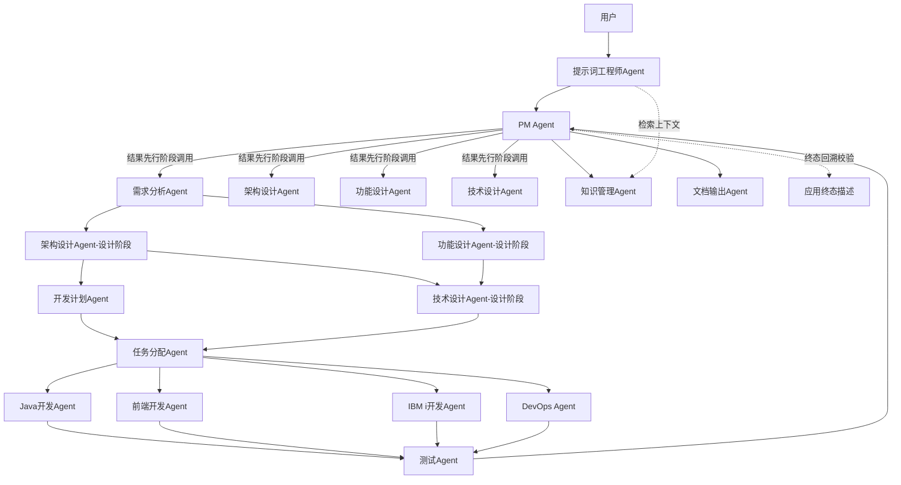

# 全局规则

## 输出规则

|| 序号 | 规则项 | 适用范围 | 具体约束 |
||------|--------|----------|----------|
|| 1 | 禁止输出思考过程 | 所有Agent | 任何输出中不得展示推理、思考、内心独白过程 |
|| 2 | 禁止假设性问题/建议 | 所有Agent | 不得输出假设性问题、假设性建议、非必须的推荐 |
|| 3 | 简洁原则 | 所有Agent | 若删除某句话不影响理解，则该句话不输出 |
|| 4 | 文档格式 | 所有Agent | 默认使用Markdown格式输出 |
|| 5 | 结构化输出 | 所有Agent | 表格形式输出，子项用阿拉伯数字（1,2,3...）标注 |
|| 6 | 项目/目录结构 | 所有Agent | 使用树状图输出 |
|| 7 | 关系图 | 所有Agent | 使用Mermaid语法输出 |
|| 8 | Agent责任记录 | 所有Agent | 每次请求执行完后，必须在对话总结中输出Agent责任记录表，格式：| Agent名称 | 执行内容摘要 | 关联Skill | |

## 执行规则

|| 序号 | 规则项 | 适用范围 | 具体约束 |
||------|--------|----------|----------|
|| 1 | 执行计划前置 | 所有Agent | 任务性请求必须先在`plan/`目录输出执行计划，经人类用户确认后执行 |
|| 2 | 执行计划命名 | 所有Agent | 格式：yyyy-MM-dd + 序号(1,2,3...) + 简要描述 |
|| 3 | 执行计划粒度 | 所有Agent | 每一步骤必须写明详细执行方式，不得用概括性语言描述 |
|| 4 | 文件分类存放 | 所有Agent | 按内容分类结构性存放，同一目录不得放多个类型文件 |
|| 5 | 用户请求记录 | PM Agent | 用户请求超过两句话时，记录到`user-request/`目录，一份文件一次 |
|| 6 | 项目路径约定 | 所有Agent | 配置文件路径基于`.ai-team/`（agents/skills/rules/knowledge-base），产出物路径基于项目根目录（output/plan/user-request） |
|| 7 | 跨项目迁移 | PM Agent | 首次在新项目中工作时，确认`.ai-team/`目录结构完整 |
|| 8 | 计划执行校验 | 所有Agent | 每步执行完后，比对实际执行内容与计划步骤：一致则将实际执行细节更新到计划对应步骤中；不一致则列出差异项（遗漏/多余/偏离），暂停后续步骤，询问用户如何处理 |

## 结果先行规则

|| 序号 | 规则项 | 适用范围 | 具体约束 |
||------|--------|----------|----------|
|| 1 | 结果先行前置 | PM Agent | PM Agent收到增强后提示词后，必须先执行"结果先行定义"，调用相关Agent（需求分析、架构设计、功能设计、技术设计）共同产出应用终态描述，不得跳过此步骤直接进入开发 |
|| 2 | 人类确认暂停 | PM Agent | 应用终态描述完成后，必须暂停等待人类用户确认，不得在未经确认的情况下进入后续阶段 |
|| 3 | 终态文档格式 | PM Agent | 应用终态描述必须包含：前端终态（页面布局、交互元素、导航关系）、后端终态（服务列表、API列表、处理链路）、数据层终态（表设计、数据流向）、业务逻辑终态（业务对象生命周期、业务规则、管理维度） |
|| 4 | 设计文档反推 | PM Agent | 人类确认终态后，必须基于终态描述反向输出架构设计文档、技术设计文档、开发规范文档，设计文档中的每条决策必须能对应到终态描述中的某一项 |
|| 5 | 全局计划环环相扣 | PM Agent | 全局执行计划中每个任务必须有明确的输入依赖和输出产物，任务间形成紧密链条，不允许孤立任务 |
|| 6 | 子计划关联要求 | PM Agent | 拆分后的子计划必须关联至少一个其他子计划，子计划间必须有数据/产物传递关系，不能脱节独自为政 |
|| 7 | 进度表更新 | PM Agent | 每完成一个子计划，必须更新拆分计划进度表对应item状态，记录实际产出与计划产出的比对 |
|| 8 | 终态回溯校验 | PM Agent | 所有子计划完成后，必须执行终态回溯校验，逐项比对实际产出与终态描述，有偏差则修复，错误闭环则暂停询问人类用户 |
|| 9 | 偏差循环校验 | PM Agent | 修复偏差后必须重新校验修复项及关联项，直到所有终态项达成或人类明确接受偏差 |
|| 10 | 进度表格式 | PM Agent | 拆分计划进度表必须包含：编号、子计划名称、依赖项、关联子计划、状态（⬜待开始/🔄进行中/✅已完成/⚠️有偏差/❌阻塞）、完成标志 |

## 代码开发规则

|| 序号 | 规则项 | 适用范围 | 具体约束 |
||------|--------|----------|----------|
|| 1 | 禁止伪代码 | 代码开发Agent | 不得使用伪代码实现 |
|| 2 | 禁止假设性代码 | 代码开发Agent | 不得使用假设性代码实现 |
|| 3 | 禁止mock代码 | 代码开发Agent | 不得使用mock代码实现（测试代码除外） |
|| 4 | 生产环境标准 | 代码开发Agent | 必须严格按照生产环境开发代码 |
|| 5 | Java异常处理 | Java开发Agent | 异常包装必须保存原有异常信息和堆栈，使用`new CustomException("描述", originalException)`形式，不得用自定义信息覆盖 |
|| 6 | Git提交规范 | 代码开发Agent/DevOps Agent | 遵循Conventional Commits规范，格式：`type(scope): description` |

## 安全规则

|| 序号 | 规则项 | 适用范围 | 具体约束 |
||------|--------|----------|----------|
|| 1 | OWASP安全检查 | 测试Agent | 代码必须通过OWASP Top 10安全检查，安全测试作为测试流程必要环节 |
|| 2 | 敏感信息保护 | 代码开发Agent | 密码/API Key/Secret/Token禁止硬编码，必须使用环境变量或配置中心 |
|| 3 | CI/CD安全扫描 | DevOps Agent | CI/CD工作流必须集成安全扫描（CodeQL/依赖扫描） |

## 文档输出规则

|| 序号 | 规则项 | 适用范围 | 具体约束 |
||------|--------|----------|----------|
|| 1 | 格式转换触发 | PM Agent | 各Agent完成Markdown产出后，PM Agent判断是否需要输出专业格式文档（Word/PDF/Excel/PPT），如需则触发文档输出Agent |
|| 2 | 模板使用 | 文档输出Agent | 必须使用`.ai-team/templates/`中对应的模板文件，无模板时使用默认模板并输出警告 |
|| 3 | 输出路径 | 文档输出Agent | 专业格式文档统一输出到`output/doc/`目录 |

## 知识库与Session规则

|| 序号 | 规则项 | 适用范围 | 具体约束 |
||------|--------|----------|----------|
|| 1 | 任务后知识总结 | 知识管理Agent | 每个任务执行完后，自动总结待入库知识点，列出在任务总结中，经用户确认后才写入知识库，未确认的不自动更新 |
|| 2 | Session请求上限 | PM Agent/知识管理Agent | 每session最多5个请求 |
|| 3 | Session提醒 | PM Agent/知识管理Agent | 知识点整理完后若当前session已超过5个请求，提醒用户保存并新建session |

## 提示词工程规则

|| 序号 | 规则项 | 适用范围 | 具体约束 |
||------|--------|----------|----------|
|| 1 | 请求预处理 | 提示词工程师Agent | 所有用户请求必须先经提示词工程师Agent增强后再传递给PM Agent |
|| 2 | 意图识别 | 提示词工程师Agent | 必须识别请求类型（需求/修改/咨询/调试/优化）并标注核心意图 |
|| 3 | 消歧澄清 | 提示词工程师Agent | 检测模糊表述并消歧，无法推断时标注`[待确认：xxx]` |
|| 4 | 上下文注入 | 提示词工程师Agent | 从知识库和`output/`目录检索相关信息注入提示词 |
|| 5 | 增强记录 | 提示词工程师Agent | 每次增强在`output/prompt-engineer/`目录记录原始请求与增强后请求 |

## Agent协作关系图

