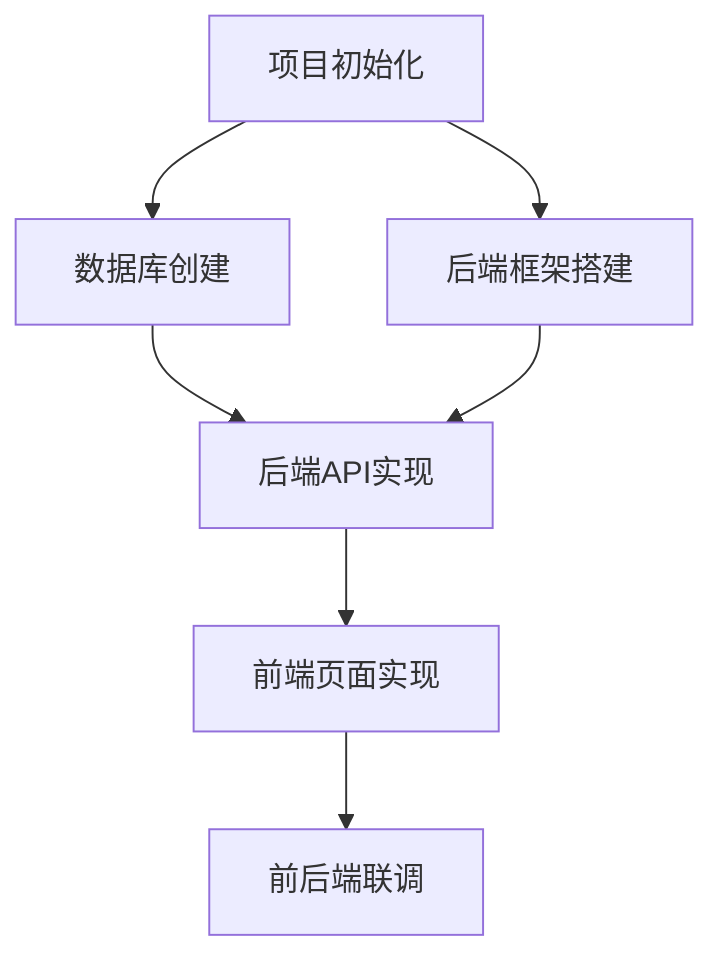

# 全局执行计划制定 Skill

## 基本信息

| 属性 | 值 |
|------|-----|
| Skill名称 | global-execution-planning |
| 所属Agent | PM Agent |
| 用途 | 基于设计文档制定环环相扣的全局详细执行计划 |

## 核心理念

**环环相扣**：全局执行计划中的每个任务必须有明确的输入依赖和输出产物，任务之间形成紧密的链条关系，不能有孤立的任务。

## 触发条件

开发/设计文档输出完成后，PM Agent调用本Skill制定全局执行计划。

## 前置依赖

- `result-first-definition` Skill已执行完成
- `design-doc-generation` Skill已执行完成
- 架构设计文档、技术设计文档、开发规范文档已产出

## 执行步骤

### 步骤1：梳理任务清单

从设计文档中梳理所有需要执行的任务：

1. **基础设施任务**：项目初始化、环境搭建、CI/CD配置
2. **数据层任务**：数据库创建、表结构定义、初始数据
3. **后端任务**：每个API接口的实现、每个处理链路的实现
4. **前端任务**：每个页面的实现、每个交互的实现
5. **集成任务**：前后端联调、外部系统集成
6. **测试任务**：单元测试、集成测试、安全测试
7. **部署任务**：部署配置、环境验证

### 步骤2：建立任务依赖关系

为每个任务标注：

1. **前置依赖**：该任务开始前必须完成的任务
2. **输出产物**：该任务完成后产出的交付物
3. **下游依赖**：依赖该任务产出的其他任务

使用Mermaid依赖图表达任务关系：



### 步骤3：定义每个任务的概要信息

为每个任务定义概要信息，**仅包含任务依赖关系和责任分配**，详细上下文和步骤留给子计划文件：

```markdown
| 任务编号 | 任务名称 | 所属阶段 | 前置依赖 | 执行Agent | 预估复杂度 |
|---------|---------|---------|---------|----------|-----------|
| T-01 | 项目初始化 | 基础设施 | 无 | DevOps Agent | 低 |
| T-02 | 数据库创建 | 数据层 | T-01 | 后端Agent | 低 |
```

### 步骤4：校验任务完整性

1. **覆盖校验**：检查终态描述中的每一项是否都有对应的任务覆盖
2. **依赖闭环校验**：检查是否存在循环依赖（A依赖B，B依赖A）
3. **孤立任务校验**：检查是否存在没有任何依赖和被依赖的任务
4. **产物传递校验**：检查每个任务的输出产物是否都被下游任务使用

### 步骤5：输出全局执行计划

将以上信息整合为全局执行计划文档，存放至`plan/`目录。

**全局执行计划只包含任务概要和依赖关系，不记录任务详细上下文。每个任务对应一个子计划文件，存放在`agent-doc/plan/sub-plans/`目录。**

文档结构：

```
# [项目名称] - 全局执行计划

## 1. 计划概览
- 任务总数
- 阶段划分
- 关键路径

## 2. 任务依赖关系图
- Mermaid依赖图

## 3. 任务概要表
| 任务编号 | 任务名称 | 所属阶段 | 前置依赖 | 执行Agent | 预估复杂度 |

## 4. 关键里程碑
- 里程碑1：[条件] → [状态]
- 里程碑2：[条件] → [状态]

## 5. 子计划文件索引
| 任务编号 | 子计划文件路径 |
|---------|--------------|
| T-01 | agent-doc/plan/sub-plans/SP-01-[名称].md |
```

## 输入

| 序号 | 输入项 | 来源 |
|------|--------|------|
| 1 | 应用终态描述文档 | `agent-doc/result-first/result-definition.md` |
| 2 | 架构设计文档 | `agent-doc/architecture/architecture-design.md` |
| 3 | 技术设计文档 | `agent-doc/technical-design/technical-design.md` |
| 4 | 开发规范文档 | `agent-doc/dev-plan/dev-standards.md` |

## 输出

| 序号 | 输出项 | 存放位置 |
|------|--------|----------|
| 1 | 全局执行计划（任务概要+依赖关系） | `plan/[yyyy-MM-dd]-global-execution-plan.md` |
| 2 | 子计划文件目录（每个任务对应一个独立子计划文档） | `agent-doc/plan/sub-plans/SP-XX-[名称].md` |

## 注意事项

1. 每个任务粒度控制在"单个开发会话可完成"的范围
2. 任务必须与终态描述中的项一一对应，不能遗漏
3. 依赖关系必须是严格的单向依赖，不允许循环
4. 关键路径上的任务需特别标注，这些任务延期会影响整体进度
5. 任务编号采用T-XX格式，按拓扑排序编号
6. 全局执行计划不记录任务上下文的详细内容，任务详细上下文、执行步骤、输出产物、偏差记录等都在独立的子计划文件中
7. 每个任务对应的子计划文件，由`plan-breakdown-tracking` Skill在拆分阶段创建
