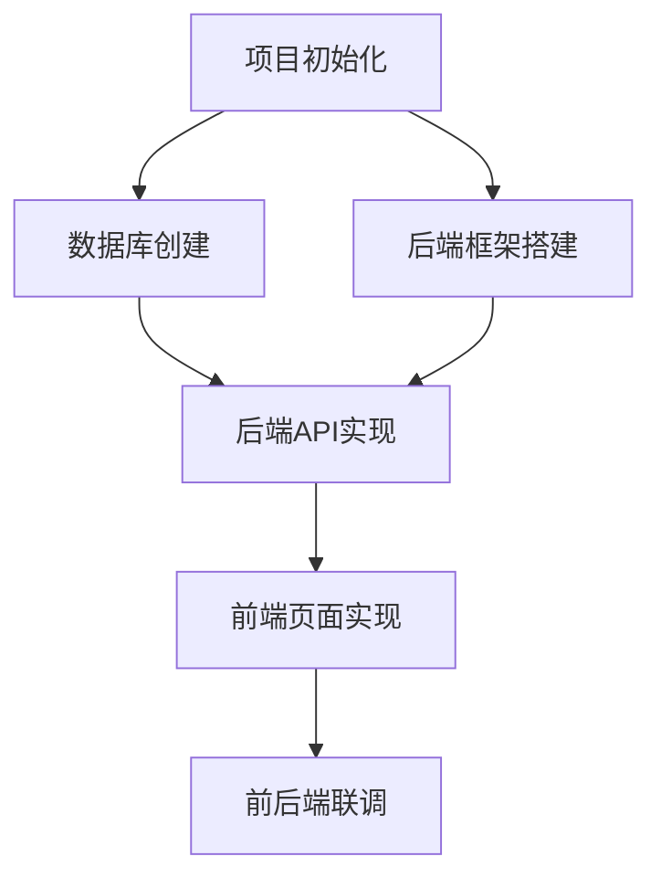

# 全局执行计划制定 Skill

## 基本信息

| 属性 | 值 |
|------|-----|
| Skill名称 | global-execution-planning |
| 所属Agent | PM Agent |
| 用途 | 基于结果蓝图和设计文档，制定轻量级全局概览计划，产出任务清单和依赖关系，为后续子计划拆分提供骨架 |

## 核心理念

**骨架先行，细节后补**：全局执行计划是轻量级的概览，只定义"做什么"和"依赖顺序"，不包含详细执行步骤。详细内容将在子计划文件中独立定义。

**蓝图驱动**：每个任务必须与结果蓝图中的一项或多项严格对应。

## 触发条件

开发/设计文档输出完成后，PM Agent调用本Skill制定全局执行计划。

## 前置依赖

- `result-first-definition` Skill已执行完成
- 结果蓝图已锁定（人类已确认）
- `design-doc-generation` Skill已执行完成

## 执行步骤

### 步骤1：读取结果蓝图

读取`agent-doc/result-first/result-definition.md`，从中提取所有需要实现的终态项：

1. 前端终态中的每个页面、每个交互元素、每个导航
2. 后端终态中的每个API、每个处理链路
3. 数据层终态中的每张表、每个数据流向
4. 业务逻辑终态中的每个业务规则、每个管理维度
5. 覆盖矩阵中的每条映射关系

### 步骤2：梳理任务清单

从结果蓝图和设计文档中梳理所有需要执行的任务，按层划分：

| 层 | 任务类型 | 对应的结果蓝图项 |
|----|---------|----------------|
| 基础设施 | 项目初始化、环境搭建、CI/CD配置 | 非功能性终态 |
| 数据层 | 数据库创建、表结构定义、初始数据 | 数据层终态每张表 |
| 后端 | 每个API接口实现、每个处理链路实现 | 后端终态每条API/链路 |
| 前端 | 每个页面实现、每个交互实现 | 前端终态每页面/交互 |
| 集成 | 前后端联调、外部系统集成 | 覆盖矩阵 |
| 测试 | 单元/集成/安全测试 | 所有终态项 |
| 部署 | 部署配置、环境验证 | 非功能性终态 |

### 步骤3：建立任务依赖关系

为每个任务标注：

1. **任务编号**：T-XX格式，按拓扑排序
2. **名称**：简洁描述
3. **前置依赖**：该任务开始前必须完成的任务
4. **对应蓝图项**：该任务实现的结果蓝图中的具体项
5. **下游依赖方**：依赖该任务的其他任务

使用Mermaid依赖图表达任务关系：



### 步骤4：校验任务完整性

1. **覆盖校验**：检查结果蓝图的覆盖矩阵中的每一项是否都有对应任务
2. **依赖闭环校验**：检查是否存在循环依赖
3. **孤立任务校验**：检查是否存在没有任何依赖和被依赖的任务

### 步骤5：输出全局执行计划（轻量概览）

```
# [项目名称] - 全局执行计划概览

## 1. 计划概览
- 任务总数：XX
- 子计划总数：XX（每个任务对应一个子计划文件）
- 阶段划分：基础设施 → 数据层 → 后端 → 前端 → 集成 → 测试 → 部署

## 2. 任务依赖图
[Mermaid依赖图]

## 3. 任务清单
| 编号 | 任务名称 | 前置依赖 | 对应蓝图项 | 负责Agent | 子计划文件 |
|------|---------|---------|-----------|-----------|-----------|
| T-01 | [任务名] | 无 | [蓝图章节/项] | [Agent] | `plan/[date]/SP-01-xxx.md` |
| T-02 | [任务名] | T-01 | [蓝图章节/项] | [Agent] | `plan/[date]/SP-02-xxx.md` |

## 4. 关键里程碑
| 里程碑 | 条件 | 涉及任务 |
|--------|------|---------|
| M1 | [条件] | T-XX ~ T-XX |
```

## 输入

| 序号 | 输入项 | 来源 |
|------|--------|------|
| 1 | 结果蓝图 | `agent-doc/result-first/result-definition.md` |
| 2 | 架构设计文档 | `agent-doc/architecture/architecture-design.md` |
| 3 | 技术设计文档 | `agent-doc/technical-design/technical-design.md` |
| 4 | 开发规范文档 | `agent-doc/dev-plan/dev-standards.md` |

## 输出

| 序号 | 输出项 | 存放位置 |
|------|--------|----------|
| 1 | 全局执行计划概览 | `plan/[yyyy-MM-dd]-global-execution-plan.md` |

## 注意事项

1. 全局执行计划是轻量概览，不包含详细执行步骤——详细内容在独立子计划文件中
2. 每个任务必须对应结果蓝图中的至少一项，且每个蓝图项必须至少有一个任务覆盖
3. 任务编号采用T-XX格式，与子计划文件编号SP-XX一一对应
4. 依赖关系必须是严格的单向依赖，不允许循环
