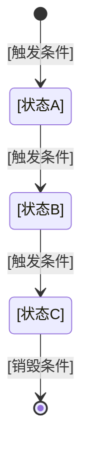

<!-- 创建时间: 2026-06-22 01:28 -->
<!-- 最后修改: 2026-06-22 01:28 -->

# 计划拆分与进度追踪 Skill

## 基本信息

| 属性 | 值 |
|------|-----|
| Skill名称 | plan-breakdown-tracking |
| 所属Agent | PM Agent |
| 用途 | 将全局执行计划中的每个任务拆分为独立子计划文件。每个子计划文件必须包含该计划所需的全部详细设计内容（数据库设计、前端线框图、逻辑设计、后端模块设计、代码结构等），Agent执行时无需参考任何其他文档即可直接开始编码或实现 |

## 核心理念

**独立子计划即完整设计包**：每个子计划文件不仅是指令，而是该子任务所需的全部设计内容的完整拷贝。子计划中物理包含了数据库表结构、ASCII线框图、API定义、业务规则、代码结构等所有设计细节。Agent打开单个子计划文件，就能获得实现该子任务所需的全部信息——零跳转、零查阅、零猜测。

## ⚠️ 蓝图→子计划逐字拷贝强制规则

**每个子计划的"最终结果"和"验收标准"必须从结果蓝图中逐字逐句完整拷贝对应章节的全部内容，不得做任何修改、删减、概括或重述。**

| 规则 | 说明 |
|------|------|
| **逐字拷贝** | 蓝图章节内容原样、完整、逐字拷贝到子计划文件中，不得重新组织语言 |
| **蓝图即结果** | 拷贝的内容即是该子计划的"最终结果"，不得另行总结或提炼 |
| **零偏差** | 拷贝内容与蓝图原文逐字一致，执行Agent以子计划中的原文为唯一依据 |
| **零跳转** | 禁止使用"详见蓝图"、"参考XX"、"同SP-XX"等跳转词——全部内容物理存在于子计划中 |
| **冲突例外** | 仅当发现蓝图章节间存在冲突矛盾时，暂停向用户提问，待确认后再执行 |

## 触发条件

全局执行计划概览完成后，PM Agent调用本Skill进行子计划拆分。

## 前置依赖

- `global-execution-planning` Skill已执行完成
- 全局执行计划概览已产出
- 结果蓝图已锁定（人类已确认）

## 执行步骤

### 步骤1：全量提取蓝图内容（逐字拷贝，不得修改）

对于全局执行计划概览中的每个任务（T-XX），从结果蓝图中**完整提取**该任务对应的所有设计内容——不是摘要，不是链接，而是**全部内容**：

1. 读取结果蓝图文件
2. 根据任务的"对应蓝图项"，定位结果蓝图中的具体章节
3. **逐字逐句完整复制**该章节的全部内容（ASCII线框图、完整字段表、API定义、业务规则等），**不得做任何修改、删减、概括或重述**。蓝图原文即是该子计划的"最终结果"和"验收标准"
4. 将复制的内容填入子计划文件的"完整设计内容"章节
5. 子计划的执行步骤必须指向这些拷贝内容中的具体项，确保每步执行可回溯到蓝图原文

### 步骤2：创建独立子计划文件

**每个子计划必须是一个独立的文件**，不得合并到同一个文件中。

文件命名规范：
```
agent-doc/plan/[确认日期]/SP-XX-[任务简短描述].md
```
示例：`agent-doc/plan/2026-05-29/SP-02-user-database-design.md`

#### 子计划文件模板（通用结构）

```markdown
# SP-XX: [子计划名称]

## 元信息

| 属性 | 值 |
|------|-----|
| 子计划编号 | SP-XX |
| 对应全局任务 | T-XX |
| 对应结果蓝图章节 | [蓝图中的章节或项] |
| 前置依赖子计划 | SP-XX, SP-XX |
| 输出产物 | [具体产物及存放路径] |
| 执行Agent | [Agent名称] |
| 预估复杂度 | [低/中/高] |

---

## 完整设计内容（从结果蓝图直引）

> 以下所有内容直接从结果蓝图中完整复制，是执行本子计划的全部设计依据。
> Agent必须严格按照以下设计内容实现，不得自行修改、猜测或补充。

### [根据子计划类型，选择对应的详细设计模板]

---

## 验收标准

对应结果蓝图中的以下项必须全部达成：

| 蓝图项 | 验收条件 | 状态 |
|--------|---------|------|
| [蓝图项编号或描述] | [具体可验证的条件] | ⬜ |

## 输入依赖

| 输入项 | 来源子计划 | 说明 |
|--------|-----------|------|
| [需要的输入] | SP-XX | [用途说明] |

## 执行步骤

| 步骤 | 操作描述 | 预期产物 |
|------|---------|---------|
| 1 | [具体操作] | [中间产物] |
| 2 | [具体操作] | [中间产物] |

## 完成标志

- [ ] 所有验收标准已达成
- [ ] 全部输出产物已产出至指定路径
- [ ] 实现内容与**完整设计内容**中的每一项一致
```

---

### 各类型子计划的完整设计内容模板

根据子计划的任务类型，选择对应的模板填充到"完整设计内容"章节中。所有模板内容必须从结果蓝图中**完整拷贝**，不得省略、概括或简化。

#### 类型A：数据库/数据层设计子计划

```markdown
### 完整设计内容

#### 表结构定义

**表名：[表名]**
| 字段名 | 类型 | 长度 | 是否可空 | 默认值 | 主键 | 外键 | 索引 | 约束 | 说明 |
|--------|------|------|---------|--------|------|------|------|------|------|
| [字段] | [类型] | [长度] | [Y/N] | [值] | [Y/N] | [Y/N] | [Y/N] | [约束] | [说明] |

**表名：[表名2]**
| 字段名 | 类型 | 长度 | 是否可空 | 默认值 | 主键 | 外键 | 索引 | 约束 | 说明 |
|--------|------|------|---------|--------|------|------|------|------|------|

#### 索引定义

| 索引名 | 表名 | 字段 | 类型(唯一/普通/全文) |
|--------|------|------|---------------------|

#### 外键关系

| 外键名 | 源表 | 源字段 | 目标表 | 目标字段 | 删除规则 | 更新规则 |
|--------|------|--------|--------|---------|---------|---------|

#### 初始数据

| 表名 | 数据内容 |
|------|---------|
| [表名] | [INSERT语句或数据表] |

#### ER关系


**Mermaid源码**：
```mermaid
erDiagram
    [表名] ||--o{ [表名2] : "一对多"
    [表名] }o--|| [表名3] : "多对一"
```

#### 数据流向

[描述数据在该子计划设计范围内的写入、读取、更新、删除路径]
```

#### 类型B：前端页面子计划

```markdown
### 完整设计内容

#### 页面ASCII线框图

```
┌─────────────────────────────────────────────────────────┐
│ [顶部导航栏: Logo / 菜单项 / 用户头像]                    │
├──────────┬──────────────────────────────────────────────┤
│          │                                              │
│ [左侧    │  [主内容区]                                    │
│  侧边栏] │                                              │
│          │  ┌──────────────────────────────────────┐    │
│ - 菜单1  │  │ [具体组件内容]                         │    │
│ - 菜单2  │  │                                      │    │
│ - 菜单3  │  └──────────────────────────────────────┘    │
│          │                                              │
├──────────┴──────────────────────────────────────────────┤
│ [底部: 状态栏/版权信息]                                   │
└─────────────────────────────────────────────────────────┘
```

（线框图必须标注每个区域的用途和内容，不得省略）

#### 页面布局说明

- 顶部：[完整描述导航栏的内容和操作]
- 左侧：[完整描述侧边栏的菜单项和功能]
- 主内容区：[完整描述内容的展示方式和数据来源]

#### 交互元素完整列表

| 元素 | 类型 | 功能描述 | 触发行为 | 前置条件 | 后置结果 |
|------|------|---------|---------|---------|---------|
| [按钮名称] | 按钮 | [做什么] | [点击后发生什么] | [什么条件下可用] | [操作后的状态] |
| [表单名称] | 表单 | [提交什么] | [提交后处理] | [什么条件下可提交] | [提交后的页面状态] |
| [列表/表格] | 数据展示 | [展示什么] | [操作行为] | [数据加载条件] | [操作后的变化] |

#### 表单字段完整定义

| 字段名 | 标签 | 类型 | 必填 | 最大长度 | 校验规则 | 错误提示 | 默认值 | 占位符 |
|--------|------|------|------|---------|---------|---------|--------|--------|
| [字段] | [标签] | [input/select/date/...] | Y/N | [长度] | [regex或规则] | [错误时显示] | [值] | [占位] |

#### 页面间导航

- 从[页面A]到本页面：通过[具体操作]（[操作条件]）
- 从本页面到[页面B]：通过[具体操作]（[操作条件]）

#### 状态管理

| 状态 | 触发条件 | 页面表现 |
|------|---------|---------|
| 加载中 | [条件] | [显示内容] |
| 空数据 | [条件] | [显示内容] |
| 错误 | [条件] | [显示内容] |
| 正常 | [条件] | [显示内容] |
```

#### 类型C：后端API/模块设计子计划

```markdown
### 完整设计内容

#### API完整定义

**API路径**：`[HTTP方法] /api/[路径]`

| 属性 | 值 |
|------|-----|
| 功能描述 | [该API的完整功能描述] |
| 对应前端操作 | [前端哪个交互元素触发] |
| 认证要求 | [是否需要登录/权限] |
| 请求类型 | [JSON/FormData/...] |

**请求参数**

| 参数名 | 位置(Path/Query/Body) | 类型 | 必填 | 默认值 | 校验规则 | 说明 |
|--------|----------------------|------|------|--------|---------|------|
| [参数] | [位置] | [类型] | Y/N | [值] | [规则] | [说明] |

**请求体示例**
```json
{
    "field1": "value1",
    "field2": "value2"
}
```

**响应格式**

| 字段 | 类型 | 必含 | 说明 |
|------|------|------|------|
| [字段] | [类型] | Y/N | [说明] |

**成功响应示例（200）**
```json
{
    "code": 200,
    "message": "success",
    "data": { ... }
}
```

**错误响应**

| 状态码 | 错误码 | 条件 | 响应体 |
|--------|--------|------|--------|
| 400 | [错误码] | [触发条件] | [响应示例] |
| 401 | [错误码] | [触发条件] | [响应示例] |
| 404 | [错误码] | [触发条件] | [响应示例] |

#### API列表（本模块所有API）

| API路径 | 方法 | 功能 | 请求参数 | 响应格式 | 对应的前端操作 |
|---------|------|------|---------|---------|-------------|
| [路径] | [方法] | [功能] | [关键参数] | [响应结构] | [前端操作] |

#### 后端处理链路

从请求到响应的完整链路：

```
请求 → [步骤1: 参数校验] → [步骤2: 业务逻辑处理]
     → [步骤3: 数据操作] → [步骤4: 响应组装] → 响应
```

- 步骤1 职责：[做什么]
- 步骤2 职责：[做什么]（涉及的业务规则编号：BR-XX）
- 步骤3 职责：[做什么]（操作的表：[表名]）
- 步骤4 职责：[做什么]

#### 异常处理

| 异常场景 | 处理方式 | 返回码 |
|---------|---------|--------|
| [场景] | [处理逻辑] | [状态码] |
```

#### 类型D：业务逻辑/规则设计子计划

```markdown
### 完整设计内容

#### 核心业务对象

**业务对象名称**：[名称]

**生命周期**：
```
[创建] → [状态A] → [状态B] → [状态C] → [销毁]
```


**Mermaid源码**：


#### 业务规则完整定义

| 规则编号 | 规则名称 | 规则描述 | 触发条件 | 执行逻辑 | 适用场景 | 约束 |
|----------|---------|---------|---------|---------|---------|------|
| BR-XX | [名称] | [完整描述] | [何时触发] | [具体逻辑] | [场景] | [限制] |

#### 管理维度

| 管理对象 | 可执行操作 | 操作者角色 | 操作权限 | 操作边界 |
|----------|-----------|-----------|---------|---------|
| [对象] | [操作列表] | [角色] | [增/删/改/查] | [条件限制] |

#### 校验规则

| 校验场景 | 字段/对象 | 规则 | 不通过处理 |
|---------|----------|------|-----------|
| [场景] | [字段] | [规则描述] | [提示/阻止] |
```

#### 类型E：代码结构与项目初始化子计划

```markdown
### 完整设计内容

#### 目录结构

```
src/
├── main/
│   ├── java/com/example/[project]/
│   │   ├── controller/          # [说明]
│   │   │   └── [文件名].java     # [说明]
│   │   ├── service/             # [说明]
│   │   │   ├── [文件名].java     # [说明]
│   │   │   └── impl/            # [说明]
│   │   ├── repository/          # [说明]
│   │   ├── model/               # [说明]
│   │   │   ├── entity/          # [说明]
│   │   │   ├── dto/             # [说明]
│   │   │   └── vo/              # [说明]
│   │   ├── config/              # [说明]
│   │   └── util/                # [说明]
│   └── resources/
│       ├── application.yml      # [配置内容摘要]
│       └── mapper/              # [说明]
└── test/
    └── java/com/example/[project]/
```

#### 技术栈

| 层次 | 技术 | 版本 | 用途 |
|------|------|------|------|
| [框架] | [名称] | [版本] | [用途] |

#### 配置文件关键内容

```yaml
# application.yml 关键配置
server:
  port: [端口]

spring:
  datasource:
    url: [连接串]
    username: [用户名]
    password: [密码]

# 其他配置...
```

#### 依赖管理

```xml
<!-- pom.xml 或 build.gradle 关键依赖 -->
<dependency>
    <groupId>[groupId]</groupId>
    <artifactId>[artifactId]</artifactId>
    <version>[version]</version>
</dependency>
```

#### 命名规范

| 类型 | 规范 | 示例 |
|------|------|------|
| 包名 | [规范] | [示例] |
| 类名 | [规范] | [示例] |
| 方法名 | [规范] | [示例] |
| 变量名 | [规范] | [示例] |
| 表名 | [规范] | [示例] |
| API路径 | [规范] | [示例] |
```

#### 类型F：测试子计划

```markdown
### 完整设计内容

#### 测试范围

[描述该子计划覆盖的测试范围，对应哪些蓝图项]

#### 单元测试

| 测试编号 | 测试类 | 测试方法 | 测试场景 | 输入数据 | 预期结果 | 对应的蓝图项 |
|----------|--------|---------|---------|---------|---------|-------------|
| UT-XX | [类名] | [方法] | [场景描述] | [输入] | [期望输出] | [蓝图项] |

#### 集成测试

| 测试编号 | 测试接口 | 测试场景 | 请求数据 | 预期响应 | 对应的蓝图项 |
|----------|---------|---------|---------|---------|-------------|
| IT-XX | [API路径] | [场景] | [请求体] | [响应码+响应体] | [蓝图项] |

#### 测试数据准备

| 表名 | 数据 |
|------|------|
| [表名] | [测试数据描述或SQL] |
```

---

### 步骤3：类型判断与内容填充

对于每个子计划，按以下规则判断类型并填充对应的完整设计内容：

| 任务类型 | 使用的模板 | 内容来源 |
|---------|-----------|---------|
| 数据库设计/数据初始化 | 类型A | 结果蓝图"数据层终态"章节 |
| 前端页面实现 | 类型B | 结果蓝图"前端终态"章节 |
| 后端API实现 | 类型C | 结果蓝图"后端终态"章节 |
| 业务逻辑实现 | 类型D | 结果蓝图"业务逻辑终态"章节 |
| 项目初始化/框架搭建 | 类型E | 结果蓝图"项目概述" + 技术设计文档 |
| 测试 | 类型F | 结果蓝图所有章节 + 验收标准 |
| 集成/联调 | 类型C + 类型B | 结果蓝图"覆盖矩阵" |

**关键规则**：所有模板内容必须从结果蓝图中**完整物理拷贝**到子计划文件中，不允许：
- ❌ "详见结果蓝图第X章"——必须把内容拷贝进来
- ❌ "同SP-XX的设计"——即使重复也要完整写出
- ❌ "字段略"或"其他字段类似"——每条字段、每个按钮、每个规则都要列出
- ❌ 使用"参考"、"详见"、"同上"等跳转词

### 步骤4：建立子计划关联关系

1. **输入关联**：在当前子计划的"输入依赖"中标注需要哪些子计划先完成
2. **输出确认**：确认当前子计划的产物被哪些子计划使用
3. **校验**：A依赖B，则B的"输出产物"必须包含A需要的输入

### 步骤5：创建进度追踪总表

创建一个进度追踪总表文件 `agent-doc/plan/[确认日期]/progress.md`：

```
# [项目名称] - 进度追踪表

| 子计划 | 任务名称 | 前置依赖 | 对应蓝图项 | 类型 | 状态 | 完成标志 |
|--------|---------|---------|-----------|------|------|---------|
| SP-01 | [名称] | 无 | [蓝图章节] | 代码结构 | ⬜待开始 | [产物] |
| SP-02 | [名称] | SP-01 | [蓝图章节] | 数据库 | ⬜待开始 | [产物] |

状态说明：
- ⬜待开始 → 🔄进行中 → ✅已完成
- ⚠️有偏差（实际与蓝图不一致）
- ❌阻塞（前置依赖未完成）
```

### 步骤6：校验子计划完整性与详细度

1. **设计内容完整性校验**：检查每个子计划文件的"完整设计内容"是否包含该类型所需的所有设计细节（如数据库子计划必须有完整的字段表+索引+外键）
2. **无跳转校验**：检查子计划文件中是否包含"参考结果蓝图"、"详见XX"、"同上"等跳转词——有则必须替换为实际内容
3. **全覆盖校验**：结果蓝图覆盖矩阵中的每一项都有对应的SP-XX子计划文件
4. **依赖闭环校验**：检查是否存在循环依赖
5. **独立性校验**：Agent打开该子计划文件后，能否在不查阅任何其他文档的情况下直接开始实现

## 输入

| 序号 | 输入项 | 来源 |
|------|--------|------|
| 1 | 结果蓝图 | `agent-doc/result-first/{yyyy-MM-dd}-{seq}-{需求简述}-result-blueprint.md` |
| 2 | 全局执行计划概览 | `agent-doc/plan/[yyyy-MM-dd]-global-execution-plan.md` |
| 3 | 各设计文档 | `agent-doc/architecture/`, `agent-doc/technical-design/` |

## 输出

| 序号 | 输出项 | 存放位置 |
|------|--------|----------|
| 1 | N个独立子计划文件（每个含完整设计内容） | `agent-doc/plan/[确认日期]/SP-XX-xxx.md` |
| 2 | 进度追踪总表 | `agent-doc/plan/[确认日期]/progress.md` |

## 进度更新规则

每个子计划完成后，PM Agent必须：

1. 更新进度追踪总表中该子计划状态为✅已完成
2. 记录实际产出，与子计划中的"验收标准"逐项比对
3. 如有偏差，标注⚠️并记录偏差内容
4. 通知依赖该子计划的下游子计划可以开始

## 注意事项

1. **每个子计划必须是独立文件**，不得将多个子计划写入同一个文件
2. **完整设计内容必须物理存在于子计划文件中**——不得使用"参考"、"详见"、"同上"等跳转词
3. **从结果蓝图中逐字逐句完整拷贝**对应章节内容，不得做任何修改、删减、概括或重述。蓝图原文即是该子计划的"最终结果"
4. 即使多个子计划用到相同的设计内容，每个子计划也必须各自完整拷贝，不得互相引用
5. Agent执行子计划时**不得要求Agent查阅任何外部文档**——所有需要的信息必须在子计划文件中
6. 子计划中的"验收标准"必须与结果蓝图中的描述**逐字一致**，不得重新总结
7. 所有子计划文件合起来必须完整覆盖结果蓝图，不能有遗漏
8. 进度追踪总表只做状态追踪，不包含详细内容——详细设计内容在各自的子计划文件中
9. **执行步骤必须指向拷贝的蓝图内容**：每个执行步骤应说明对应蓝图原文中的哪个具体项，确保执行可回溯到蓝图
10. **冲突例外**：仅当发现蓝图章节间存在冲突矛盾时，暂停向用户提问，待确认后再继续
