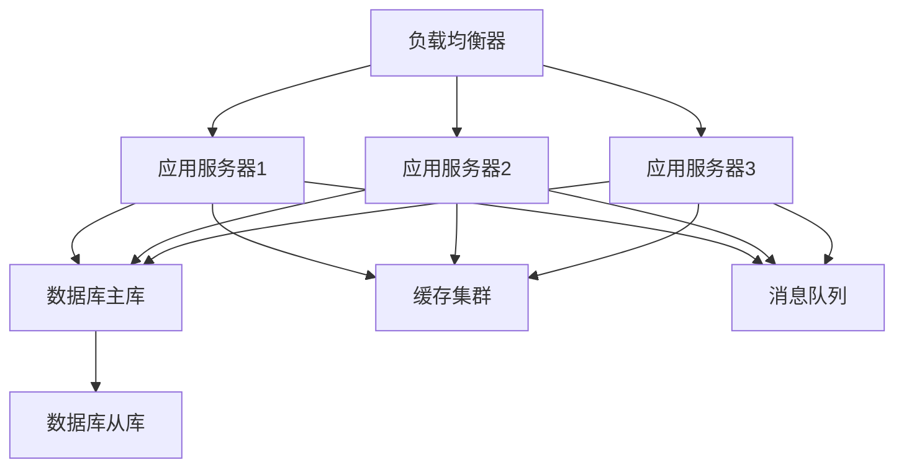

<!-- 创建时间: 2026-07-25 08:54 -->
<!-- 最后修改: 2026-07-25 08:54 -->

# 部署文档模板

> 适用于AI自动化开发的结构化部署文档，支持"部署运维"和"持续集成"工作流程

---

## 1. 文档概述

| 字段 | 内容 |
|------|------|
| **文档名称** | [项目名称]部署文档 |
| **文档版本** | [版本号] |
| **创建日期** | [YYYY-MM-DD] |
| **最后更新** | [YYYY-MM-DD] |
| **项目背景** | [简要描述项目背景] |
| **部署目标** | [部署要达成的具体目标] |
| **参考文档** | [设计文档、测试文档名称及位置] |

---

## 2. 环境要求

### 2.1 硬件要求

| 组件 | 最低配置 | 推荐配置 | 说明 |
|------|---------|---------|------|
| CPU | [配置] | [配置] | [说明] |
| 内存 | [配置] | [配置] | [说明] |
| 硬盘 | [配置] | [配置] | [说明] |
| 网络 | [配置] | [配置] | [说明] |

### 2.2 软件要求

| 软件类型 | 软件名称 | 版本要求 | 用途 | 许可证 |
|---------|---------|---------|------|--------|
| 操作系统 | [系统] | [版本] | [用途] | [许可证] |
| 数据库 | [数据库] | [版本] | [用途] | [许可证] |
| 中间件 | [中间件] | [版本] | [用途] | [许可证] |
| 运行环境 | [环境] | [版本] | [用途] | [许可证] |
| 依赖库 | [库] | [版本] | [用途] | [许可证] |

### 2.3 网络要求

| 端口 | 协议 | 方向 | 源地址 | 目标地址 | 用途 | 防火墙规则 |
|------|------|------|--------|---------|------|-----------|
| [端口] | [协议] | [入站/出站] | [地址] | [地址] | [用途] | [规则] |
| ... | ... | ... | ... | ... | ... | ... |

### 2.4 依赖服务

| 服务名称 | 服务地址 | 服务版本 | 连接方式 | 认证方式 | 用途 |
|---------|---------|---------|---------|---------|------|
| [服务] | [地址] | [版本] | [方式] | [方式] | [用途] |
| ... | ... | ... | ... | ... | ... |

---

## 3. 部署架构

### 3.1 部署架构图



### 3.2 组件部署规划

| 组件名称 | 部署节点 | 部署目录 | 端口 | 实例数 | 高可用方案 |
|---------|---------|---------|------|--------|-----------|
| [组件1] | [节点] | [目录] | [端口] | [数量] | [方案] |
| [组件2] | [节点] | [目录] | [端口] | [数量] | [方案] |
| ... | ... | ... | ... | ... | ... |

### 3.3 数据流设计

```
[用户请求] → [负载均衡] → [应用服务器] → [数据库/缓存/MQ] → [响应]
```

### 3.4 安全架构

| 安全层 | 安全措施 | 实现方式 | 验证方法 |
|--------|---------|---------|---------|
| 网络安全 | [措施] | [方式] | [方法] |
| 应用安全 | [措施] | [方式] | [方法] |
| 数据安全 | [措施] | [方式] | [方法] |
| 访问控制 | [措施] | [方式] | [方法] |

---

## 4. 部署流程

### 4.1 部署前准备

| 准备项 | 准备内容 | 负责人 | 检查方法 | 状态 |
|--------|---------|--------|---------|------|
| 环境准备 | [内容] | [负责人] | [方法] | [状态] |
| 依赖安装 | [内容] | [负责人] | [方法] | [状态] |
| 配置准备 | [内容] | [负责人] | [方法] | [状态] |
| 数据准备 | [内容] | [负责人] | [方法] | [状态] |
| 备份准备 | [内容] | [负责人] | [方法] | [状态] |

### 4.2 部署步骤

**阶段1：环境准备**
```bash
# 步骤1：系统更新
[命令]

# 步骤2：依赖安装
[命令]

# 步骤3：用户创建
[命令]

# 步骤4：目录创建
[命令]
```

**阶段2：应用部署**
```bash
# 步骤1：应用包下载
[命令]

# 步骤2：应用解压
[命令]

# 步骤3：配置文件修改
[命令]

# 步骤4：权限设置
[命令]
```

**阶段3：服务配置**
```bash
# 步骤1：服务配置
[命令]

# 步骤2：启动脚本
[命令]

# 步骤3：日志配置
[命令]

# 步骤4：监控配置
[命令]
```

**阶段4：服务启动**
```bash
# 步骤1：启动服务
[命令]

# 步骤2：状态检查
[命令]

# 步骤3：日志检查
[命令]

# 步骤4：功能验证
[命令]
```

### 4.3 部署验证

| 验证项 | 验证内容 | 验证方法 | 预期结果 | 实际结果 | 负责人 |
|--------|---------|---------|---------|---------|--------|
| 服务状态 | [内容] | [方法] | [结果] | [实际] | [负责人] |
| 端口监听 | [内容] | [方法] | [结果] | [实际] | [负责人] |
| 日志检查 | [内容] | [方法] | [结果] | [实际] | [负责人] |
| 功能测试 | [内容] | [方法] | [结果] | [实际] | [负责人] |
| 性能测试 | [内容] | [方法] | [结果] | [实际] | [负责人] |

### 4.4 回滚方案

| 回滚场景 | 回滚步骤 | 回滚时间 | 回滚负责人 | 验证方法 |
|---------|---------|---------|-----------|---------|
| 部署失败 | [步骤] | [时间] | [负责人] | [方法] |
| 配置错误 | [步骤] | [时间] | [负责人] | [方法] |
| 数据问题 | [步骤] | [时间] | [负责人] | [方法] |
| 性能问题 | [步骤] | [时间] | [负责人] | [方法] |

---

## 5. 配置管理

### 5.1 配置文件清单

| 配置文件 | 文件路径 | 配置内容 | 环境变量 | 版本控制 |
|---------|---------|---------|---------|---------|
| [配置1] | [路径] | [内容] | [变量] | [控制] |
| [配置2] | [路径] | [内容] | [变量] | [控制] |
| ... | ... | ... | ... | ... |

### 5.2 环境变量配置

| 变量名 | 变量值 | 说明 | 默认值 | 是否必填 | 敏感信息 |
|--------|--------|------|--------|---------|---------|
| [变量] | [值] | [说明] | [默认] | 是/否 | 是/否 |
| ... | ... | ... | ... | ... | ... |

### 5.3 数据库配置

| 配置项 | 配置值 | 说明 | 默认值 | 是否必填 |
|--------|--------|------|--------|---------|
| 数据库地址 | [地址] | [说明] | [默认] | 是/否 |
| 数据库端口 | [端口] | [说明] | [默认] | 是/否 |
| 数据库名称 | [名称] | [说明] | [默认] | 是/否 |
| 数据库用户 | [用户] | [说明] | [默认] | 是/否 |
| 数据库密码 | [密码] | [说明] | [默认] | 是/否 |

### 5.4 缓存配置

| 配置项 | 配置值 | 说明 | 默认值 | 是否必填 |
|--------|--------|------|--------|---------|
| 缓存地址 | [地址] | [说明] | [默认] | 是/否 |
| 缓存端口 | [端口] | [说明] | [默认] | 是/否 |
| 缓存密码 | [密码] | [说明] | [默认] | 是/否 |
| 缓存数据库 | [数据库] | [说明] | [默认] | 是/否 |

### 5.5 消息队列配置

| 配置项 | 配置值 | 说明 | 默认值 | 是否必填 |
|--------|--------|------|--------|---------|
| MQ地址 | [地址] | [说明] | [默认] | 是/否 |
| MQ端口 | [端口] | [说明] | [默认] | 是/否 |
| MQ用户 | [用户] | [说明] | [默认] | 是/否 |
| MQ密码 | [密码] | [说明] | [默认] | 是/否 |

---

## 6. 运维手册

### 6.1 日常运维

#### 6.1.1 服务管理

| 操作 | 命令 | 说明 | 频率 | 负责人 |
|------|------|------|------|--------|
| 启动服务 | [命令] | [说明] | [频率] | [负责人] |
| 停止服务 | [命令] | [说明] | [频率] | [负责人] |
| 重启服务 | [命令] | [说明] | [频率] | [负责人] |
| 查看状态 | [命令] | [说明] | [频率] | [负责人] |
| 查看日志 | [命令] | [说明] | [频率] | [负责人] |

#### 6.1.2 监控检查

| 检查项 | 检查命令 | 检查频率 | 检查标准 | 异常处理 |
|--------|---------|---------|---------|---------|
| 服务状态 | [命令] | [频率] | [标准] | [处理] |
| 资源使用 | [命令] | [频率] | [标准] | [处理] |
| 日志错误 | [命令] | [频率] | [标准] | [处理] |
| 性能指标 | [命令] | [频率] | [标准] | [处理] |

#### 6.1.3 备份恢复

| 备份类型 | 备份内容 | 备份命令 | 备份频率 | 保留时间 | 恢复命令 |
|---------|---------|---------|---------|---------|---------|
| 全量备份 | [内容] | [命令] | [频率] | [时间] | [命令] |
| 增量备份 | [内容] | [命令] | [频率] | [时间] | [命令] |
| 配置备份 | [内容] | [命令] | [频率] | [时间] | [命令] |
| 日志备份 | [内容] | [命令] | [频率] | [时间] | [命令] |

### 6.2 故障处理

#### 6.2.1 故障分类

| 故障等级 | 定义 | 影响范围 | 响应时间 | 处理时限 |
|---------|------|---------|---------|---------|
| P0 | [定义] | [范围] | [时间] | [时限] |
| P1 | [定义] | [范围] | [时间] | [时限] |
| P2 | [定义] | [范围] | [时间] | [时限] |
| P3 | [定义] | [范围] | [时间] | [时限] |

#### 6.2.2 故障处理流程

```
[故障发现] → [故障确认] → [故障诊断] → [故障处理] → [故障恢复] → [故障总结]
   ↓           ↓           ↓           ↓           ↓           ↓
[监控告警]   [影响评估]   [原因分析]   [应急处理]   [服务恢复]   [复盘改进]
```

#### 6.2.3 常见故障处理

| 故障类型 | 故障现象 | 可能原因 | 处理步骤 | 预防措施 |
|---------|---------|---------|---------|---------|
| 服务无法启动 | [现象] | [原因] | [步骤] | [措施] |
| 接口响应慢 | [现象] | [原因] | [步骤] | [措施] |
| 内存溢出 | [现象] | [原因] | [步骤] | [措施] |
| 数据库连接失败 | [现象] | [原因] | [步骤] | [措施] |

### 6.3 性能优化

#### 6.3.1 性能监控指标

| 指标类别 | 指标名称 | 监控工具 | 告警阈值 | 优化方向 |
|---------|---------|---------|---------|---------|
| 系统指标 | CPU使用率 | [工具] | [阈值] | [方向] |
| 系统指标 | 内存使用率 | [工具] | [阈值] | [方向] |
| 应用指标 | 响应时间 | [工具] | [阈值] | [方向] |
| 应用指标 | 吞吐量 | [工具] | [阈值] | [方向] |
| 数据库指标 | 查询时间 | [工具] | [阈值] | [方向] |

#### 6.3.2 性能优化方案

| 优化场景 | 优化方案 | 实施步骤 | 预期效果 | 风险评估 |
|---------|---------|---------|---------|---------|
| CPU优化 | [方案] | [步骤] | [效果] | [风险] |
| 内存优化 | [方案] | [步骤] | [效果] | [风险] |
| 数据库优化 | [方案] | [步骤] | [效果] | [风险] |
| 网络优化 | [方案] | [步骤] | [效果] | [风险] |

### 6.4 安全运维

#### 6.4.1 安全策略

| 安全层 | 安全策略 | 实施方法 | 检查频率 | 负责人 |
|--------|---------|---------|---------|--------|
| 网络安全 | [策略] | [方法] | [频率] | [负责人] |
| 主机安全 | [策略] | [方法] | [频率] | [负责人] |
| 应用安全 | [策略] | [方法] | [频率] | [负责人] |
| 数据安全 | [策略] | [方法] | [频率] | [负责人] |

#### 6.4.2 安全检查

| 检查项 | 检查内容 | 检查方法 | 检查频率 | 负责人 |
|--------|---------|---------|---------|--------|
| 系统补丁 | [内容] | [方法] | [频率] | [负责人] |
| 账户安全 | [内容] | [方法] | [频率] | [负责人] |
| 访问控制 | [内容] | [方法] | [频率] | [负责人] |
| 日志审计 | [内容] | [方法] | [频率] | [负责人] |

---

## 7. 监控告警

### 7.1 监控体系

| 监控层次 | 监控内容 | 监控工具 | 采集频率 | 告警阈值 |
|---------|---------|---------|---------|---------|
| 基础设施监控 | [内容] | [工具] | [频率] | [阈值] |
| 应用监控 | [内容] | [工具] | [频率] | [阈值] |
| 业务监控 | [内容] | [工具] | [频率] | [阈值] |
| 日志监控 | [内容] | [工具] | [频率] | [阈值] |

### 7.2 告警策略

| 告警级别 | 告警条件 | 通知方式 | 通知人员 | 处理时限 |
|---------|---------|---------|---------|---------|
| 紧急 | [条件] | [方式] | [人员] | [时限] |
| 重要 | [条件] | [方式] | [人员] | [时限] |
| 一般 | [条件] | [方式] | [人员] | [时限] |
| 提示 | [条件] | [方式] | [人员] | [时限] |

### 7.3 告警处理

| 告警类型 | 告警内容 | 处理步骤 | 升级机制 | 处理文档 |
|---------|---------|---------|---------|---------|
| 服务宕机 | [内容] | [步骤] | [机制] | [文档] |
| 性能告警 | [内容] | [步骤] | [机制] | [文档] |
| 错误告警 | [内容] | [步骤] | [机制] | [文档] |
| 安全告警 | [内容] | [步骤] | [机制] | [文档] |

### 7.4 监控看板

| 看板名称 | 监控指标 | 刷新频率 | 访问权限 | 负责人 |
|---------|---------|---------|---------|--------|
| 系统总览 | [指标] | [频率] | [权限] | [负责人] |
| 应用监控 | [指标] | [频率] | [权限] | [负责人] |
| 业务监控 | [指标] | [频率] | [权限] | [负责人] |
| 安全监控 | [指标] | [频率] | [权限] | [负责人] |

---

## 8. 自动化部署

### 8.1 CI/CD流程

```
[代码提交] → [代码检查] → [单元测试] → [构建打包] → [部署测试] → [部署生产] → [监控验证]
   ↓           ↓           ↓           ↓           ↓           ↓           ↓
[Git Push]   [Lint]      [Test]      [Build]     [Deploy]    [Release]   [Monitor]
```

### 8.2 自动化脚本

| 脚本名称 | 脚本功能 | 使用场景 | 运行环境 | 维护责任 |
|---------|---------|---------|---------|---------|
| [脚本1] | [功能] | [场景] | [环境] | [责任] |
| [脚本2] | [功能] | [场景] | [环境] | [责任] |
| ... | ... | ... | ... | ... |

### 8.3 部署工具

| 工具名称 | 工具版本 | 用途 | 配置方式 | 许可证 |
|---------|---------|------|---------|--------|
| [工具1] | [版本] | [用途] | [方式] | [许可证] |
| [工具2] | [版本] | [用途] | [方式] | [许可证] |
| ... | ... | ... | ... | ... |

### 8.4 容器化部署

| 组件 | 容器镜像 | 镜像版本 | 资源限制 | 健康检查 |
|------|---------|---------|---------|---------|
| [组件1] | [镜像] | [版本] | [限制] | [检查] |
| [组件2] | [镜像] | [版本] | [限制] | [检查] |
| ... | ... | ... | ... | ... |

---

## 9. 完整性自检清单

### 9.1 环境要求完整性

| 检查项 | 检查内容 | 结果 |
|--------|---------|------|
| 硬件要求完整性 | 所有硬件要求已定义 | ✅/❌ |
| 软件要求完整性 | 所有软件要求已定义 | ✅/❌ |
| 网络要求完整性 | 所有网络要求已定义 | ✅/❌ |
| 依赖服务完整性 | 所有依赖服务已定义 | ✅/❌ |

### 9.2 部署流程完整性

| 检查项 | 检查内容 | 结果 |
|--------|---------|------|
| 部署前准备完整性 | 所有准备工作已定义 | ✅/❌ |
| 部署步骤完整性 | 所有部署步骤已定义 | ✅/❌ |
| 部署验证完整性 | 所有验证项目已定义 | ✅/❌ |
| 回滚方案完整性 | 所有回滚方案已定义 | ✅/❌ |

### 9.3 配置管理完整性

| 检查项 | 检查内容 | 结果 |
|--------|---------|------|
| 配置文件完整性 | 所有配置文件已定义 | ✅/❌ |
| 环境变量完整性 | 所有环境变量已定义 | ✅/❌ |
| 数据库配置完整性 | 所有数据库配置已定义 | ✅/❌ |
| 缓存配置完整性 | 所有缓存配置已定义 | ✅/❌ |

### 9.4 运维手册完整性

| 检查项 | 检查内容 | 结果 |
|--------|---------|------|
| 日常运维完整性 | 所有运维操作已定义 | ✅/❌ |
| 故障处理完整性 | 所有故障处理已定义 | ✅/❌ |
| 性能优化完整性 | 所有优化方案已定义 | ✅/❌ |
| 安全运维完整性 | 所有安全策略已定义 | ✅/❌ |

### 9.5 监控告警完整性

| 检查项 | 检查内容 | 结果 |
|--------|---------|------|
| 监控体系完整性 | 所有监控项已定义 | ✅/❌ |
| 告警策略完整性 | 所有告警策略已定义 | ✅/❌ |
| 告警处理完整性 | 所有告警处理流程已定义 | ✅/❌ |
| 监控看板完整性 | 所有监控看板已定义 | ✅/❌ |

---

## 10. 附录

### 10.1 术语表

| 术语 | 定义 |
|------|------|
| [术语1] | [定义] |
| [术语2] | [定义] |
| ... | ... |

### 10.2 参考文档

| 文档名称 | 文档位置 | 说明 |
|---------|---------|------|
| [文档1] | [位置] | [说明] |
| [文档2] | [位置] | [说明] |
| ... | ... | ... |

### 10.3 变更记录

| 版本 | 日期 | 变更内容 | 变更人 |
|------|------|---------|--------|
| 1.0 | [日期] | 初始版本 | [姓名] |
| ... | ... | ... | ... |

---

## 11. 使用说明

### 11.1 模板使用规则

1. **必填字段**：所有带`[ ]`的字段必须填写，不得留空
2. **可选字段**：如某些字段不适用，填写"N/A"并说明原因
3. **完整性要求**：所有部署步骤必须完整，命令必须可执行
4. **一致性要求**：部署文档与设计文档、测试文档保持一致
5. **可追溯性**：每个配置项必须有明确标识，便于后续跟踪

### 11.2 AI自动化开发适配

1. **结构化格式**：所有内容使用表格或结构化格式，便于AI解析
2. **命令化操作**：所有操作必须提供可执行命令，便于AI自动化
3. **明确关系**：元素之间的关联关系必须明确标注
4. **完整覆盖**：部署文档必须覆盖所有环境和场景
5. **可验证性**：每个部署步骤必须有可验证的检查方法

### 11.3 与其他文档的关系

| 文档 | 关系 | 说明 |
|------|------|------|
| 设计文档 | 输入 | 设计文档是部署文档的依据 |
| 测试文档 | 输入 | 测试文档是部署验证的依据 |
| 用户文档 | 输出 | 部署文档是用户文档的基础 |
| 运维手册 | 输出 | 部署文档是运维手册的基础 |

---

【模板使用说明】
1. 复制此模板，重命名为：`[项目名称]-deployment-[版本号]-[日期].md`
2. 按照模板结构填写所有必填字段
3. 完成后执行完整性自检清单
4. 提交给相关人员评审
5. 评审通过后存入`agent-doc/`对应目录