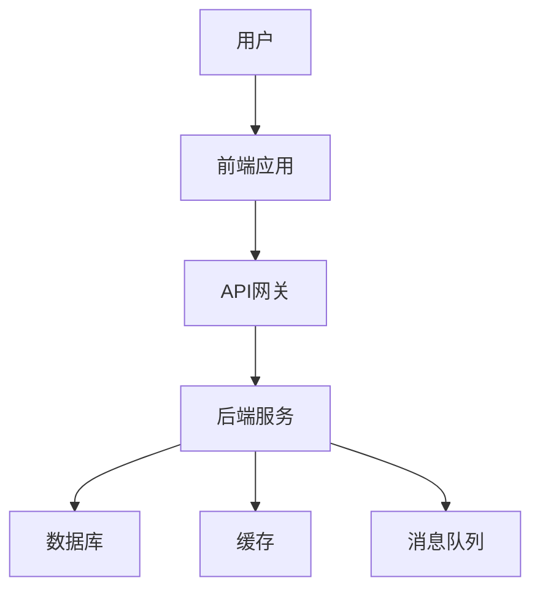

<!-- 创建时间: 2026-07-25 08:54 -->
<!-- 最后修改: 2026-07-25 08:54 -->

# 设计文档模板

> 适用于AI自动化开发的结构化设计文档，支持"结果先行"工作流程

---

## 1. 文档概述

| 字段 | 内容 |
|------|------|
| **文档名称** | [项目名称]设计文档 |
| **文档版本** | [版本号] |
| **创建日期** | [YYYY-MM-DD] |
| **最后更新** | [YYYY-MM-DD] |
| **项目背景** | [简要描述项目背景] |
| **设计目标** | [设计要达成的具体目标] |
| **参考文档** | [需求文档名称及位置] |

---

## 2. 架构设计

### 2.1 系统架构图

**架构图描述**：[描述系统整体架构]



### 2.2 模块划分

| 模块ID | 模块名称 | 职责描述 | 技术选型 | 选型理由 | 依赖关系 |
|--------|---------|---------|---------|---------|---------|
| M001 | [模块1] | [职责] | [技术+版本] | [理由] | [依赖] |
| M002 | [模块2] | [职责] | [技术+版本] | [理由] | [依赖] |
| ... | ... | ... | ... | ... | ... |

### 2.3 技术栈选型

| 层次 | 技术组件 | 版本 | 用途 | 选型理由 |
|------|---------|------|------|---------|
| 前端 | [框架] | [版本] | [用途] | [理由] |
| 后端 | [框架] | [版本] | [用途] | [理由] |
| 数据库 | [数据库] | [版本] | [用途] | [理由] |
| 缓存 | [缓存] | [版本] | [用途] | [理由] |
| 消息队列 | [MQ] | [版本] | [用途] | [理由] |
| 部署 | [容器/云服务] | [版本] | [用途] | [理由] |

### 2.4 部署方案

| 环境 | 服务器规格 | 中间件 | 高可用方案 | 监控方案 |
|------|-----------|--------|-----------|---------|
| 开发 | [规格] | [名称] | [方案] | [方案] |
| 测试 | [规格] | [名称] | [方案] | [方案] |
| 生产 | [规格] | [名称] | [方案] | [方案] |

### 2.5 安全架构

| 安全层 | 安全措施 | 实现方式 | 验证方法 |
|--------|---------|---------|---------|
| 网络安全 | [措施] | [方式] | [方法] |
| 应用安全 | [措施] | [方式] | [方法] |
| 数据安全 | [措施] | [方式] | [方法] |
| 认证授权 | [措施] | [方式] | [方法] |

---

## 3. 详细设计

### 3.1 模块详细设计

#### 模块：[模块名称]

**模块概述**
| 字段 | 内容 |
|------|------|
| 模块ID | [MXXX] |
| 模块名称 | [名称] |
| 职责描述 | [职责] |
| 技术选型 | [技术] |

**类/组件设计**
| 类/组件ID | 类/组件名称 | 职责 | 方法列表 | 依赖 |
|-----------|------------|------|---------|------|
| C001 | [类名] | [职责] | [方法列表] | [依赖] |
| C002 | [类名] | [职责] | [方法列表] | [依赖] |
| ... | ... | ... | ... | ... |

**流程设计**
```
[步骤1] → [步骤2] → [步骤3] → [步骤4]
   ↓           ↓           ↓           ↓
[处理1]    [处理2]    [处理3]    [处理4]
```

**状态流转**
```
[状态1] → [状态2]（通过[事件]）
[状态2] → [状态3]（通过[事件]）
[状态2] → [状态1]（通过[事件]）
```

### 3.2 接口设计

#### 3.2.1 内部接口

**接口：[接口名称]**
| 字段 | 内容 |
|------|------|
| 接口ID | [IXXX] |
| 接口名称 | [名称] |
| 调用模块 | [调用方] → [被调用方] |
| 通信方式 | [同步/异步] |
| 接口协议 | [REST/gRPC/消息] |

**请求参数**
| 参数名 | 位置 | 类型 | 必填 | 说明 | 示例值 |
|--------|------|------|------|------|--------|
| [参数] | [query/body/path] | [类型] | 是/否 | [说明] | [示例] |
| ... | ... | ... | ... | ... | ... |

**响应格式**
```json
{
  "code": 200,
  "message": "success",
  "data": {
    "field1": "value1",
    "field2": "value2"
  }
}
```

**错误码**
| 错误码 | 含义 | 处理建议 |
|--------|------|---------|
| [错误码] | [含义] | [建议] |
| ... | ... | ... |

#### 3.2.2 外部接口

**接口：[接口名称]**
| 字段 | 内容 |
|------|------|
| 接口ID | [EXXX] |
| 接口名称 | [名称] |
| 外部系统 | [系统名称] |
| 接口类型 | [REST/SOAP/消息] |
| 调用方向 | [调用/被调用] |

**接口详细定义**
[参照内部接口格式]

---

## 4. 数据库设计

### 4.1 数据库选型

| 数据库 | 版本 | 用途 | 选型理由 |
|--------|------|------|---------|
| [数据库] | [版本] | [用途] | [理由] |
| ... | ... | ... | ... |

### 4.2 数据表设计

#### 表：[表名]

**表结构**
| 字段名 | 类型 | 长度 | 主键 | 外键 | 索引 | 默认值 | 说明 |
|--------|------|------|------|------|------|--------|------|
| id | BIGINT | 20 | PK | - | Y | auto_increment | 主键 |
| [字段] | [类型] | [长度] | - | FK→[表.字段] | Y/N | [值] | [说明] |
| ... | ... | ... | ... | ... | ... | ... | ... |

**索引设计**
| 索引名 | 索引字段 | 索引类型 | 用途 |
|--------|---------|---------|------|
| idx_[字段] | [字段] | [唯一/普通] | [用途] |
| ... | ... | ... | ... |

**外键关系**
| 外键字段 | 关联表 | 关联字段 | 关系类型 |
|---------|--------|---------|---------|
| [字段] | [表] | [字段] | [一对一/一对多/多对多] |
| ... | ... | ... | ... |

### 4.3 数据字典

| 表名 | 字段名 | 字段说明 | 数据类型 | 取值范围 | 业务规则 |
|------|--------|---------|---------|---------|---------|
| [表] | [字段] | [说明] | [类型] | [范围] | [规则] |
| ... | ... | ... | ... | ... | ... |

### 4.4 数据迁移策略

| 迁移场景 | 迁移策略 | 回滚方案 | 验证方法 |
|---------|---------|---------|---------|
| 新增表 | [策略] | [方案] | [方法] |
| 修改表 | [策略] | [方案] | [方法] |
| 删除表 | [策略] | [方案] | [方法] |

---

## 5. 前端设计

### 5.1 页面结构

| 页面ID | 页面名称 | 组件列表 | 路由路径 | 布局 |
|--------|---------|---------|---------|------|
| P001 | [页面] | [组件列表] | [路由] | [布局] |
| ... | ... | ... | ... | ... |

### 5.2 组件设计

#### 组件：[组件名称]

**组件概述**
| 字段 | 内容 |
|------|------|
| 组件ID | [CXXX] |
| 组件名称 | [名称] |
| 组件类型 | [页面/表单/列表/弹窗等] |
| 所属页面 | [页面名称] |

**Props定义**
| 属性名 | 类型 | 必填 | 默认值 | 说明 |
|--------|------|------|--------|------|
| [属性] | [类型] | 是/否 | [值] | [说明] |
| ... | ... | ... | ... | ... |

**State定义**
| 状态名 | 类型 | 初始值 | 说明 |
|--------|------|--------|------|
| [状态] | [类型] | [值] | [说明] |
| ... | ... | ... | ... |

**事件处理**
| 事件名 | 触发条件 | 处理函数 | 关联API |
|--------|---------|---------|---------|
| [事件] | [条件] | [函数] | [API] |
| ... | ... | ... | ... |

### 5.3 状态管理

| 状态类型 | 状态名称 | 作用域 | 存储位置 | 更新方式 |
|---------|---------|--------|---------|---------|
| 全局状态 | [状态] | [作用域] | [位置] | [方式] |
| 局部状态 | [状态] | [作用域] | [位置] | [方式] |
| ... | ... | ... | ... | ... |

### 5.4 路由设计

| 路由路径 | 页面组件 | 权限要求 | 页面标题 | 面包屑 |
|---------|---------|---------|---------|--------|
| [路径] | [组件] | [权限] | [标题] | [面包屑] |
| ... | ... | ... | ... | ... |

---

## 6. 后端设计

### 6.1 分层架构

| 层次 | 职责 | 技术组件 | 目录结构 |
|------|------|---------|---------|
| 控制层 | [职责] | [组件] | [目录] |
| 服务层 | [职责] | [组件] | [目录] |
| 数据访问层 | [职责] | [组件] | [目录] |
| 领域层 | [职责] | [组件] | [目录] |

### 6.2 API设计

#### 6.2.1 API列表

| 方法 | 路径 | 功能 | 请求参数 | 响应格式 | 错误码 |
|------|------|------|---------|---------|--------|
| GET | /api/xxx | [功能] | [参数表] | [JSON结构] | [码:含义] |
| POST | /api/xxx | [功能] | [参数表] | [JSON结构] | [码:含义] |
| PUT | /api/xxx | [功能] | [参数表] | [JSON结构] | [码:含义] |
| DELETE | /api/xxx | [功能] | [参数表] | [JSON结构] | [码:含义] |

#### 6.2.2 API详细定义

**API：[方法] [路径]**

**请求参数**
| 参数名 | 位置 | 类型 | 必填 | 说明 | 示例值 |
|--------|------|------|------|------|--------|
| [参数] | [query/body/path] | [类型] | 是/否 | [说明] | [示例] |
| ... | ... | ... | ... | ... | ... |

**响应体**
```json
{
  "code": 200,
  "message": "success",
  "data": {
    "field1": "value1",
    "field2": "value2"
  }
}
```

**错误响应**
```json
{
  "code": 400,
  "message": "错误信息",
  "details": "详细错误信息"
}
```

**错误码**
| 错误码 | 含义 | HTTP状态码 | 处理建议 |
|--------|------|-----------|---------|
| [错误码] | [含义] | [状态码] | [建议] |
| ... | ... | ... | ... |

### 6.3 服务设计

#### 服务：[服务名称]

**服务概述**
| 字段 | 内容 |
|------|------|
| 服务ID | [SXXX] |
| 服务名称 | [名称] |
| 服务职责 | [职责] |
| 依赖服务 | [服务列表] |

**方法列表**
| 方法名 | 方法职责 | 入参 | 出参 | 调用链路 |
|--------|---------|------|------|---------|
| [方法] | [职责] | [参数] | [返回] | [链路] |
| ... | ... | ... | ... | ... |

**业务流程**
```
[请求] → [控制器] → [服务层] → [数据访问层] → [数据库]
  ↓         ↓           ↓            ↓            ↓
[校验]   [路由]    [业务逻辑]    [ORM操作]    [SQL执行]
```

### 6.4 缓存设计

| 缓存场景 | 缓存Key | 缓存策略 | 过期时间 | 更新机制 |
|---------|---------|---------|---------|---------|
| [场景] | [Key] | [策略] | [时间] | [机制] |
| ... | ... | ... | ... | ... |

### 6.5 消息队列设计

| 消息场景 | 队列名称 | 消息格式 | 生产者 | 消费者 | 重试策略 |
|---------|---------|---------|--------|--------|---------|
| [场景] | [队列] | [格式] | [生产者] | [消费者] | [策略] |
| ... | ... | ... | ... | ... | ... |

---

## 7. 测试设计

### 7.1 测试策略

| 测试类型 | 测试范围 | 测试工具 | 覆盖率要求 |
|---------|---------|---------|-----------|
| 单元测试 | [范围] | [工具] | [要求] |
| 集成测试 | [范围] | [工具] | [要求] |
| 系统测试 | [范围] | [工具] | [要求] |
| 性能测试 | [范围] | [工具] | [要求] |

### 7.2 测试用例设计

**模块：[模块名称]**

| 用例ID | 用例名称 | 前置条件 | 测试步骤 | 预期结果 | 优先级 |
|--------|---------|---------|---------|---------|--------|
| TC001 | [用例] | [条件] | [步骤] | [结果] | [优先级] |
| ... | ... | ... | ... | ... | ... |

### 7.3 性能测试场景

| 场景ID | 场景名称 | 并发数 | 请求频率 | 响应时间要求 | 资源限制 |
|--------|---------|--------|---------|-------------|---------|
| PT001 | [场景] | [数量] | [频率] | [时间] | [限制] |
| ... | ... | ... | ... | ... | ... |

---

## 8. 安全设计

### 8.1 认证设计

| 认证方式 | 适用场景 | 实现机制 | 安全要求 |
|---------|---------|---------|---------|
| [方式] | [场景] | [机制] | [要求] |
| ... | ... | ... | ... |

### 8.2 授权设计

| 授权模型 | 适用场景 | 实现机制 | 权限粒度 |
|---------|---------|---------|---------|
| [模型] | [场景] | [机制] | [粒度] |
| ... | ... | ... | ... |

### 8.3 数据安全

| 安全措施 | 适用数据 | 实现方式 | 验证方法 |
|---------|---------|---------|---------|
| 加密存储 | [数据] | [方式] | [方法] |
| 脱敏显示 | [数据] | [方式] | [方法] |
| 审计日志 | [数据] | [方式] | [方法] |

### 8.4 接口安全

| 安全措施 | 适用接口 | 实现方式 | 验证方法 |
|---------|---------|---------|---------|
| HTTPS | [接口] | [方式] | [方法] |
| 签名验证 | [接口] | [方式] | [方法] |
| 限流控制 | [接口] | [方式] | [方法] |

---

## 9. 运维设计

### 9.1 监控设计

| 监控类型 | 监控指标 | 监控工具 | 告警阈值 | 处理方式 |
|---------|---------|---------|---------|---------|
| 应用监控 | [指标] | [工具] | [阈值] | [方式] |
| 基础设施监控 | [指标] | [工具] | [阈值] | [方式] |
| 业务监控 | [指标] | [工具] | [阈值] | [方式] |

### 9.2 日志设计

| 日志类型 | 日志级别 | 日志格式 | 存储位置 | 保留时间 |
|---------|---------|---------|---------|---------|
| 应用日志 | [级别] | [格式] | [位置] | [时间] |
| 访问日志 | [级别] | [格式] | [位置] | [时间] |
| 错误日志 | [级别] | [格式] | [位置] | [时间] |

### 9.3 部署设计

| 环境 | 部署方式 | 部署工具 | 回滚策略 | 验证方法 |
|------|---------|---------|---------|---------|
| 开发 | [方式] | [工具] | [策略] | [方法] |
| 测试 | [方式] | [工具] | [策略] | [方法] |
| 生产 | [方式] | [工具] | [策略] | [方法] |

### 9.4 备份设计

| 备份类型 | 备份内容 | 备份频率 | 备份工具 | 恢复时间 |
|---------|---------|---------|---------|---------|
| 全量备份 | [内容] | [频率] | [工具] | [时间] |
| 增量备份 | [内容] | [频率] | [工具] | [时间] |
| 日志备份 | [内容] | [频率] | [工具] | [时间] |

---

## 10. 完整性自检清单

### 10.1 架构设计完整性

| 检查项 | 检查内容 | 结果 |
|--------|---------|------|
| 系统架构图完整性 | 系统架构图是否完整展示所有组件 | ✅/❌ |
| 模块划分完整性 | 所有模块已定义，职责已明确 | ✅/❌ |
| 技术栈选型完整性 | 所有技术组件已选型，理由已说明 | ✅/❌ |
| 部署方案完整性 | 所有环境部署方案已设计 | ✅/❌ |
| 安全架构完整性 | 所有安全措施已设计 | ✅/❌ |

### 10.2 详细设计完整性

| 检查项 | 检查内容 | 结果 |
|--------|---------|------|
| 模块详细设计完整性 | 所有模块详细设计已完成 | ✅/❌ |
| 接口设计完整性 | 所有接口已设计，参数已定义 | ✅/❌ |
| 数据库设计完整性 | 所有表已设计，字段已定义 | ✅/❌ |
| 前端设计完整性 | 所有页面和组件已设计 | ✅/❌ |
| 后端设计完整性 | 所有API和服务已设计 | ✅/❌ |

### 10.3 设计一致性检查

| 检查项 | 检查内容 | 结果 |
|--------|---------|------|
| 需求-设计一致性 | 设计是否完整覆盖所有需求 | ✅/❌ |
| 接口-数据一致性 | 接口设计与数据库设计是否一致 | ✅/❌ |
| 前端-后端一致性 | 前端设计与后端设计是否一致 | ✅/❌ |
| 安全-功能一致性 | 安全设计是否覆盖所有功能点 | ✅/❌ |

### 10.4 设计质量检查

| 检查项 | 检查内容 | 结果 |
|--------|---------|------|
| 设计可实现性 | 设计是否可以在现有技术条件下实现 | ✅/❌ |
| 设计可维护性 | 设计是否便于后续维护和扩展 | ✅/❌ |
| 设计可测试性 | 设计是否便于测试验证 | ✅/❌ |
| 设计性能 | 设计是否满足性能要求 | ✅/❌ |

---

## 11. 附录

### 11.1 术语表

| 术语 | 定义 |
|------|------|
| [术语1] | [定义] |
| [术语2] | [定义] |
| ... | ... |

### 11.2 参考文档

| 文档名称 | 文档位置 | 说明 |
|---------|---------|------|
| [文档1] | [位置] | [说明] |
| [文档2] | [位置] | [说明] |
| ... | ... | ... |

### 11.3 变更记录

| 版本 | 日期 | 变更内容 | 变更人 |
|------|------|---------|--------|
| 1.0 | [日期] | 初始版本 | [姓名] |
| ... | ... | ... | ... |

---

## 12. 使用说明

### 12.1 模板使用规则

1. **必填字段**：所有带`[ ]`的字段必须填写，不得留空
2. **可选字段**：如某些字段不适用，填写"N/A"并说明原因
3. **完整性要求**：所有模块、接口、表必须完整设计
4. **一致性要求**：设计之间不得存在矛盾或冲突
5. **可追溯性**：每个设计元素必须有唯一ID，便于后续跟踪

### 12.2 AI自动化开发适配

1. **结构化格式**：所有内容使用表格或结构化格式，便于AI解析
2. **唯一标识符**：每个元素都有唯一ID，便于AI引用和关联
3. **明确关系**：元素之间的关联关系必须明确标注
4. **完整覆盖**：设计必须覆盖所有需求和边界情况
5. **可验证性**：每个设计必须有可验证的验收标准

### 12.3 与其他文档的关系

| 文档 | 关系 | 说明 |
|------|------|------|
| 需求文档 | 输入 | 需求文档是设计文档的输入 |
| 测试文档 | 输入 | 设计文档是测试用例的依据 |
| 用户文档 | 输入 | 设计文档是用户手册的基础 |
| 项目计划 | 输入 | 设计文档是项目估算的依据 |

---

【模板使用说明】
1. 复制此模板，重命名为：`[项目名称]-design-[版本号]-[日期].md`
2. 按照模板结构填写所有必填字段
3. 完成后执行完整性自检清单
4. 提交给相关人员评审
5. 评审通过后存入`agent-doc/`对应目录