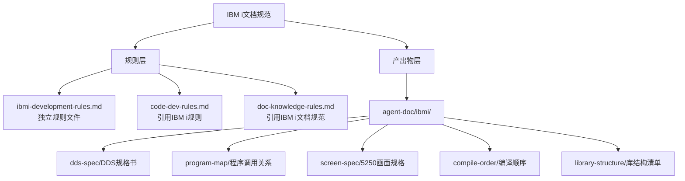

<!-- 创建时间: 2026-07-25 00:00 -->
<!-- 最后修改: 2026-07-25 00:00 -->

# IBM i文档规范 — 架构设计文档

## 1. 架构概述

本文档定义IBM i项目文档规范的架构设计，包括规则层和产出物层的组织结构。

## 2. 架构图



## 3. 模块划分

| 模块 | 职责 | 技术选型 | 选型理由 |
|------|------|---------|---------|
| ibmi-development-rules.md | IBM i开发规则定义 | Markdown | 独立规则文件，便于维护引用 |
| agent-doc/ibmi/dds-spec/ | DDS规格文档存放 | 目录 | 物理文件/逻辑文件/显示文件定义 |
| agent-doc/ibmi/program-map/ | 程序调用关系文档 | 目录 | RPG/CL调用链路、服务程序接口 |
| agent-doc/ibmi/screen-spec/ | 5250画面规格文档 | 目录 | DSPF布局、子文件结构 |
| agent-doc/ibmi/compile-order/ | 编译顺序文档 | 目录 | 对象依赖、编译命令序列 |
| agent-doc/ibmi/library-structure/ | 库结构清单文档 | 目录 | 开发/测试/生产库对象清单 |

## 4. 规则文件结构

```
.ai-team/rules/
├── workflow.md
├── output-execution-rules.md
├── code-dev-rules.md
├── security-rules.md
├── doc-knowledge-rules.md
├── audit-rules.md
├── agent-roles.md
├── references.md
└── ibmi-development-rules.md    ← 新增
```

## 5. 产出物目录结构

```
agent-doc/
├── ibmi/                         ← 新增顶层目录
│   ├── dds-spec/                 ← DDS规格书
│   │   ├── {项目}-{日期}-pf-spec.md
│   │   ├── {项目}-{日期}-lf-spec.md
│   │   ├── {项目}-{日期}-dspf-spec.md
│   │   └── {项目}-{日期}-prtf-spec.md
│   ├── program-map/              ← 程序调用关系
│   │   └── {项目}-{日期}-call-map.md
│   ├── screen-spec/              ← 5250画面规格
│   │   └── {项目}-{日期}-screen-layout.md
│   ├── compile-order/            ← 编译顺序
│   │   └── {项目}-{日期}-compile-sequence.md
│   └── library-structure/        ← 库结构清单
│       └── {项目}-{日期}-library-inventory.md
├── architecture/
├── technical-design/
├── feature-design/
└── ...
```

## 6. 模块间交互关系

| 调用方 | 被调用方 | 通信方式 | 接口协议 |
|--------|---------|---------|---------|
| PM Agent | ibmi-development-rules.md | 读取规则 | Markdown |
| 核查Agent | agent-doc/ibmi/* | 读取文档 | Markdown |
| code-dev-rules.md | ibmi-development-rules.md | 引用 | 文件路径 |

## 7. 部署方案

| 环境 | 服务器 | 中间件 | 高可用方案 |
|------|--------|--------|-----------|
| 规则文件 | 本地 | 无 | Git版本控制 |
| 文档产出物 | 本地 | 无 | Git版本控制 |
