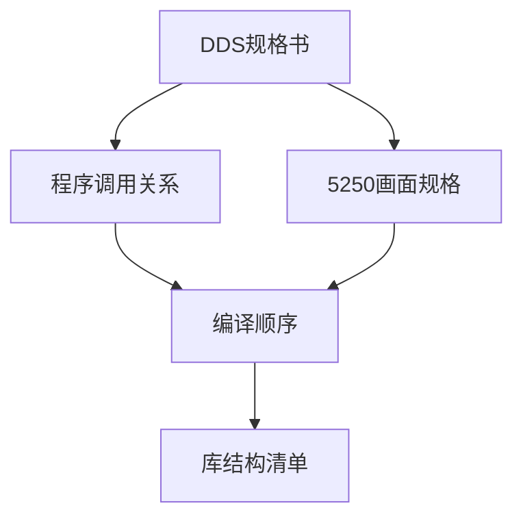

<!-- 创建时间: 2026-07-25 00:00 -->
<!-- 最后修改: 2026-07-25 00:00 -->

# IBM i文档规范 — 功能设计文档

## 1. 功能概述

本文档定义IBM i项目文档规范的功能设计，包括5类文档模板的功能定义和使用场景。

## 2. 功能清单

| 功能模块 | 功能名称 | 功能描述 | 使用场景 |
|---------|---------|---------|---------|
| DDS规格书 | 物理文件规格 | 定义PF的字段、类型、键值 | 数据库设计阶段 |
| DDS规格书 | 逻辑文件规格 | 定义LF的选择条件、排序规则 | 数据查询设计 |
| DDS规格书 | 显示文件规格 | 定义DSPF的布局、字段、功能键 | 画面设计阶段 |
| DDS规格书 | 打印文件规格 | 定义PRTF的报表格式 | 报表设计阶段 |
| 程序调用关系 | 调用关系图 | 可视化程序间调用链路 | 架构设计阶段 |
| 程序调用关系 | 程序清单 | 列出所有程序及其功能 | 开发文档 |
| 程序调用关系 | 服务程序接口 | 定义SRVPGM的导出过程 | 接口设计阶段 |
| 5250画面规格 | 画面清单 | 列出所有DSPF及其功能 | 画面设计阶段 |
| 5250画面规格 | 画面布局 | ASCII线框图展示画面结构 | 画面开发阶段 |
| 5250画面规格 | 子文件规格 | 定义SFL的字段、行数、功能 | 子文件开发 |
| 编译顺序 | 编译清单 | 列出所有对象的编译顺序 | 构建阶段 |
| 编译顺序 | 编译命令 | 提供完整的编译命令序列 | 自动化构建 |
| 库结构清单 | 环境配置 | 定义开发/测试/生产环境 | 环境配置阶段 |
| 库结构清单 | 源文件清单 | 列出所有源物理文件 | 项目初始化 |
| 库结构清单 | 对象清单 | 列出所有编译后的对象 | 部署阶段 |

## 3. 功能详细设计

### 3.1 DDS规格书功能

#### 3.1.1 物理文件规格
**输入**：ERD图、数据字典
**处理**：
1. 解析ERD中的实体和属性
2. 映射到IBM i字段类型（A/P/L/Z/T）
3. 定义主键和外键
4. 生成DDS格式的规格书

**输出**：`{项目}-{日期}-pf-spec.md`

**交互元素**：
| 元素 | 类型 | 操作 | 反馈 |
|------|------|------|------|
| 字段表格 | 表格 | 编辑 | 实时预览 |
| 键值选择 | 下拉框 | 选择 | 自动高亮 |

#### 3.1.2 逻辑文件规格
**输入**：物理文件规格、查询需求
**处理**：
1. 分析查询需求
2. 定义选择条件（SELECT/OMIT）
3. 定义排序规则
4. 生成LF规格书

**输出**：`{项目}-{日期}-lf-spec.md`

#### 3.1.3 显示文件规格
**输入**：线框图、交互元素列表
**处理**：
1. 解析线框图布局
2. 映射到DDS字段定义
3. 定义功能键（CF03/CF05/CF12）
4. 定义子文件结构
5. 生成DSPF规格书

**输出**：`{项目}-{日期}-dspf-spec.md`

#### 3.1.4 打印文件规格
**输入**：报表样例、数据字典
**处理**：
1. 分析报表布局
2. 定义页眉/详情/页脚
3. 定义字段格式
4. 生成PRTF规格书

**输出**：`{项目}-{日期}-prtf-spec.md`

### 3.2 程序调用关系功能

#### 3.2.1 调用关系图
**输入**：程序列表、调用关系
**处理**：
1. 解析程序间调用关系
2. 生成Mermaid流程图
3. 标注调用类型（同步/异步）
4. 生成调用关系文档

**输出**：`{项目}-{日期}-call-map.md`

**交互元素**：
| 元素 | 类型 | 操作 | 反馈 |
|------|------|------|------|
| 流程图 | Mermaid | 编辑 | 实时渲染 |
| 程序节点 | 拖拽 | 调整位置 | 自动布局 |

#### 3.2.2 程序清单
**输入**：源码目录、程序注释
**处理**：
1. 扫描源码获取程序信息
2. 解析注释获取功能描述
3. 分析调用关系
4. 生成程序清单

**输出**：程序清单表格

#### 3.2.3 服务程序接口
**输入**：SRVPGM源码、BND文件
**处理**：
1. 解析BND文件获取导出符号
2. 分析Dcl-Pr定义获取参数
3. 生成接口文档

**输出**：服务程序接口表格

### 3.3 5250画面规格功能

#### 3.3.1 画面清单
**输入**：DSPF源码、功能需求
**处理**：
1. 扫描DSPF源码
2. 提取功能键定义
3. 识别子文件结构
4. 生成画面清单

**输出**：`{项目}-{日期}-screen-layout.md`

#### 3.3.2 画面布局
**输入**：DSPF源码、DDS规范
**处理**：
1. 解析DSPF的R命令
2. 生成ASCII线框图
3. 标注字段位置和类型
4. 生成画面布局文档

**输出**：ASCII线框图

#### 3.3.3 子文件规格
**输入**：DSPF中的SFL/SFLCTL定义
**处理**：
1. 识别SFL和SFLCTL
2. 提取SFLSIZ/SFLPAG
3. 分析字段定义
4. 生成子文件规格

**输出**：子文件规格表格

### 3.4 编译顺序功能

#### 3.4.1 编译清单
**输入**：对象列表、依赖关系
**处理**：
1. 分析对象依赖关系
2. 拓扑排序确定编译顺序
3. 生成编译清单

**输出**：`{项目}-{日期}-compile-sequence.md`

**交互元素**：
| 元素 | 类型 | 操作 | 反馈 |
|------|------|------|------|
| 依赖图 | Mermaid | 编辑 | 实时渲染 |
| 顺序表格 | 表格 | 编辑 | 自动验证依赖 |

#### 3.4.2 编译命令
**输入**：编译清单、编译参数
**处理**：
1. 根据对象类型选择编译命令
2. 填充编译参数
3. 生成CL脚本

**输出**：编译命令脚本

### 3.5 库结构清单功能

#### 3.5.1 环境配置
**输入**：环境信息、服务器配置
**处理**：
1. 定义环境名称和库名
2. 配置服务器连接
3. 生成环境配置文档

**输出**：`{项目}-{日期}-library-inventory.md`

#### 3.5.2 源文件清单
**输入**：库结构、源物理文件列表
**处理**：
1. 扫描库中的源物理文件
2. 统计成员数量
3. 生成源文件清单

**输出**：源文件清单表格

#### 3.5.3 对象清单
**输入**：库结构、对象列表
**处理**：
1. 扫描库中的所有对象
2. 按类型分类统计
3. 生成对象清单

**输出**：对象清单表格

## 4. 功能依赖关系

## 5. 功能验收标准

| 功能模块 | 验收标准 |
|---------|---------|
| DDS规格书 | 5个模板全部可用，示例完整 |
| 程序调用关系 | 调用图可渲染，清单完整 |
| 5250画面规格 | 布局可读，子文件定义完整 |
| 编译顺序 | 顺序正确，命令可执行 |
| 库结构清单 | 环境配置完整，清单准确 |
