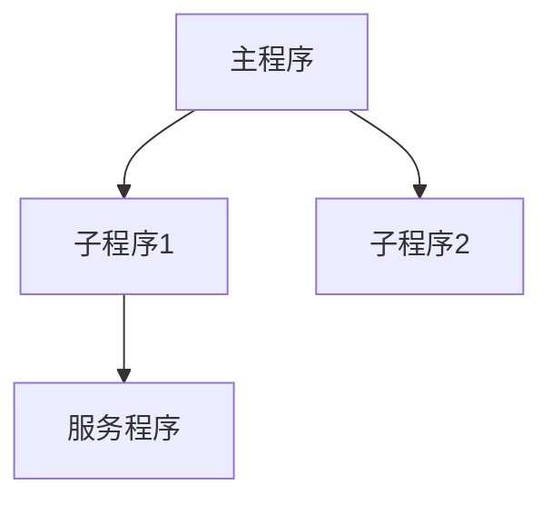

<!-- 创建时间: 2026-07-25 00:00 -->
<!-- 最后修改: 2026-07-25 00:00 -->

# {项目名} — 程序调用关系

## 1. 调用关系图

---

## 2. 程序清单

| 程序名 | 类型 | 功能 | 调用程序 | 被调用程序 |
|--------|------|------|---------|-----------|
| {程序} | {RPG/CL} | {功能} | {调用者} | {被调用者} |

---

## 3. 服务程序接口

| 服务程序 | 导出过程 | 参数 | 返回值 |
|---------|---------|------|--------|
| {SRVPGM} | {过程} | {参数} | {返回} |
