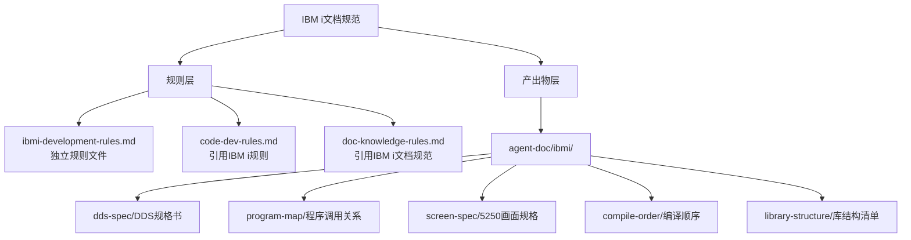

<!-- 创建时间: 2026-07-25 00:00 -->
<!-- 最后修改: 2026-07-25 00:00 -->

# SP-01 规则文件创建

## 1. 子计划概述

| 字段 | 值 |
|------|-----|
| 子计划编号 | SP-01 |
| 子计划名称 | 规则文件创建 |
| 类型 | A-规则 |
| 技术栈 | Markdown |
| 前置依赖 | 无 |
| 负责Agent | 代码开发Agent |

## 2. 最终结果（逐字拷贝自结果蓝图）

### 架构设计Agent产出 — 系统架构终态

#### 架构图

**Mermaid源码**（使用 `flowchart` 语法）：


#### 模块划分
| 模块 | 职责 | 技术选型 | 选型理由 |
|------|------|---------|---------|
| ibmi-development-rules.md | IBM i开发规则定义 | Markdown | 独立规则文件，便于维护引用 |
| agent-doc/ibmi/dds-spec/ | DDS规格文档存放 | 目录 | 物理文件/逻辑文件/显示文件定义 |
| agent-doc/ibmi/program-map/ | 程序调用关系文档 | 目录 | RPG/CL调用链路、服务程序接口 |
| agent-doc/ibmi/screen-spec/ | 5250画面规格文档 | 目录 | DSPF布局、子文件结构 |
| agent-doc/ibmi/compile-order/ | 编译顺序文档 | 目录 | 对象依赖、编译命令序列 |
| agent-doc/ibmi/library-structure/ | 库结构清单文档 | 目录 | 开发/测试/生产库对象清单 |

#### 模块间交互关系
| 调用方 | 被调用方 | 通信方式 | 接口协议 |
|--------|---------|---------|---------|
| PM Agent | ibmi-development-rules.md | 读取规则 | Markdown |
| 核查Agent | agent-doc/ibmi/* | 读取文档 | Markdown |
| code-dev-rules.md | ibmi-development-rules.md | 引用 | 文件路径 |

---

## 3. 执行步骤

| 步骤 | 操作 | 预期产出 | 产出路径 |
|------|------|---------|---------|
| 1 | 创建ibmi-development-rules.md | 规则文件 | .ai-team/rules/ibmi-development-rules.md |
| 2 | 更新code-dev-rules.md | 引用IBM i规则 | .ai-team/rules/code-dev-rules.md |
| 3 | 更新doc-knowledge-rules.md | 引用IBM i文档规范 | .ai-team/rules/doc-knowledge-rules.md |

### 步骤1详细说明：创建ibmi-development-rules.md

**文件内容**：IBM i开发规则，包含以下章节：
1. DDS规范（PF/LF/DSPF/PRTF）
2. 程序调用规范（RPG/CL）
3. 5250画面规范
4. 编译顺序规范
5. 库结构规范

**文件格式**：
```markdown
<!-- 创建时间: yyyy-MM-dd HH:mm -->
<!-- 最后修改: yyyy-MM-dd HH:mm -->

# IBM i开发规则

---

## 1. DDS规范
...
```

### 步骤2详细说明：更新code-dev-rules.md

**更新内容**：在"4. IBM i (AS/400) 开发规则"小节中添加引用：

```markdown
> 详细规范见 `.ai-team/rules/ibmi-development-rules.md`。
```

### 步骤3详细说明：更新doc-knowledge-rules.md

**更新内容**：在"3. 知识库引用指引"小节中添加引用：

```markdown
| IBM i 文档规范 | ibmi-development-rules.md | 遵循文档规范 |
```

---

## 4. 验收标准

| 验收标准 | 状态 | 说明 |
|---------|------|------|
| ibmi-development-rules.md 创建完成 | 待验证 | 包含完整IBM i开发规范 |
| code-dev-rules.md 更新完成 | 待验证 | 正确引用IBM i规则 |
| doc-knowledge-rules.md 更新完成 | 待验证 | 正确引用IBM i文档规范 |
| 所有文件包含元数据时间戳 | 待验证 | 创建时间和最后修改时间 |
| Git提交完成 | 待验证 | 变更已提交 |

---

## 5. 风险与缓解

| 风险 | 概率 | 影响 | 缓解措施 |
|------|------|------|---------|
| 与现有规则冲突 | 低 | 高 | 提前审查现有规则 |
| 格式不规范 | 低 | 中 | 遵循Markdown规范 |
