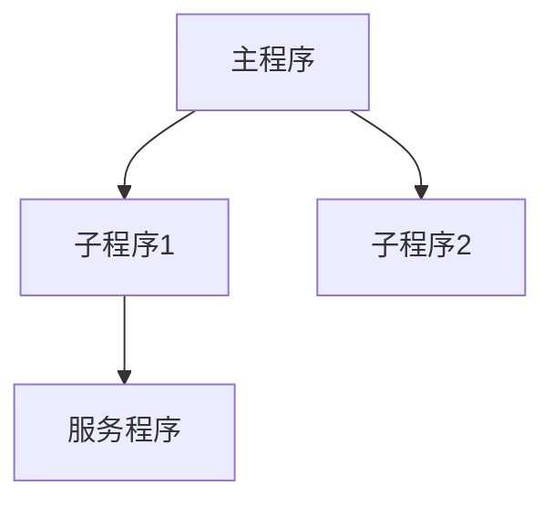

<!-- 创建时间: 2026-07-25 00:00 -->
<!-- 最后修改: 2026-07-25 00:00 -->

# SP-02 产出物目录与模板创建

## 1. 子计划概述

| 字段 | 值 |
|------|-----|
| 子计划编号 | SP-02 |
| 子计划名称 | 产出物目录与模板创建 |
| 类型 | B-目录 |
| 技术栈 | Markdown |
| 前置依赖 | SP-01 |
| 负责Agent | 代码开发Agent |

## 2. 最终结果（逐字拷贝自结果蓝图）

### 功能设计Agent产出 — 功能与交互终态

**产出物目录结构**：
```
agent-doc/
├── ibmi/                         ← 新增顶层目录
│   ├── dds-spec/                 ← DDS规格书
│   │   ├── {项目}-{日期}-pf-spec.md
│   │   ├── {项目}-{日期}-lf-spec.md
│   │   ├── {项目}-{日期}-dspf-spec.md
│   │   └── {项目}-{日期}-prtf-spec.md
│   ├── program-map/              ← 程序调用关系
│   │   └── {项目}-{日期}-call-map.md
│   ├── screen-spec/              ← 5250画面规格
│   │   └── {项目}-{日期}-screen-layout.md
│   ├── compile-order/            ← 编译顺序
│   │   └── {项目}-{日期}-compile-sequence.md
│   └── library-structure/        ← 库结构清单
│       └── {项目}-{日期}-library-inventory.md
├── architecture/
├── technical-design/
├── feature-design/
└── ...
```

**表单：DDS规格书模板**
| 字段 | 类型 | 必填 | 校验规则 | 默认值 |
|------|------|------|---------|--------|
| 文件名 | 文本 | 是 | ≤10字符，大写 | — |
| 记录格式名 | 文本 | 是 | ≤10字符 | — |
| 字段名 | 文本 | 是 | ≤10字符 | — |
| 字段类型 | 选择 | 是 | A/P/S/L/Z/T | — |
| 字段长度 | 数字 | 是 | >0 | — |
| 小数位数 | 数字 | 否 | ≥0 | 0 |
| 键值标识 | 选择 | 否 | K/空 | 空 |
| 描述 | 文本 | 否 | ≤50字符 | — |

---

## 3. 执行步骤

| 步骤 | 操作 | 预期产出 | 产出路径 |
|------|------|---------|---------|
| 1 | 创建agent-doc/ibmi/目录 | 顶层目录 | agent-doc/ibmi/ |
| 2 | 创建dds-spec/目录及模板 | DDS规格书模板 | agent-doc/ibmi/dds-spec/ |
| 3 | 创建program-map/目录及模板 | 程序调用关系模板 | agent-doc/ibmi/program-map/ |
| 4 | 创建screen-spec/目录及模板 | 5250画面规格模板 | agent-doc/ibmi/screen-spec/ |
| 5 | 创建compile-order/目录及模板 | 编译顺序模板 | agent-doc/ibmi/compile-order/ |
| 6 | 创建library-structure/目录及模板 | 库结构清单模板 | agent-doc/ibmi/library-structure/ |

### 步骤1详细说明：创建agent-doc/ibmi/目录

**操作**：创建顶层目录
```bash
mkdir -p agent-doc/ibmi
```

### 步骤2详细说明：创建dds-spec/目录及模板

**目录操作**：
```bash
mkdir -p agent-doc/ibmi/dds-spec
```

**模板文件**：`{项目}-{日期}-pf-spec.md`

**模板内容**：
```markdown
<!-- 创建时间: yyyy-MM-dd HH:mm -->
<!-- 最后修改: yyyy-MM-dd HH:mm -->

# {项目名} — DDS规格书

## 1. 物理文件(PF)规格

### 1.1 {文件名}
| 字段名 | 类型 | 长度 | 小数位 | 键值 | 描述 |
|--------|------|------|--------|------|------|
| {字段} | {A/P/L} | {长度} | {小数} | {K/空} | {描述} |

**记录格式名**: {格式名}
**键值**: {键字段列表}

## 2. 逻辑文件(LF)规格

### 2.1 {文件名}
| 字段名 | 类型 | 长度 | 小数位 | 键值 | 描述 |
|--------|------|------|--------|------|------|
| {字段} | {A/P/L} | {长度} | {小数} | {K/空} | {描述} |

**记录格式名**: {格式名}
**基于文件**: {PF文件名}
**选择条件**: {SELECT/OMIT}

## 3. 显示文件(DSPF)规格

### 3.1 {文件名}
| 字段名 | 类型 | 位置 | 使用类型 | 描述 |
|--------|------|------|---------|------|
| {字段} | {类型} | {行列} | {B/I/O/H} | {描述} |

**功能键**: {CF03/CF05/CF12}
**子文件**: {SFL名称}

## 4. 打印文件(PRTF)规格

### 4.1 {文件名}
| 区域 | 字段名 | 类型 | 位置 | 描述 |
|------|--------|------|------|------|
| HEAD1 | {字段} | {类型} | {位置} | {描述} |
| DETAIL | {字段} | {类型} | {位置} | {描述} |
| FOOT1 | {字段} | {类型} | {位置} | {描述} |
```

### 步骤3详细说明：创建program-map/目录及模板

**目录操作**：
```bash
mkdir -p agent-doc/ibmi/program-map
```

**模板文件**：`{项目}-{日期}-call-map.md`

**模板内容**：
```markdown
<!-- 创建时间: yyyy-MM-dd HH:mm -->
<!-- 最后修改: yyyy-MM-dd HH:mm -->

# {项目名} — 程序调用关系

## 1. 调用关系图



## 2. 程序清单

| 程序名 | 类型 | 功能 | 调用程序 | 被调用程序 |
|--------|------|------|---------|-----------|
| {程序} | {RPG/CL} | {功能} | {调用者} | {被调用者} |

## 3. 服务程序接口

| 服务程序 | 导出过程 | 参数 | 返回值 |
|---------|---------|------|--------|
| {SRVPGM} | {过程} | {参数} | {返回} |
```

### 步骤4详细说明：创建screen-spec/目录及模板

**目录操作**：
```bash
mkdir -p agent-doc/ibmi/screen-spec
```

**模板文件**：`{项目}-{日期}-screen-layout.md`

**模板内容**：
```markdown
<!-- 创建时间: yyyy-MM-dd HH:mm -->
<!-- 最后修改: yyyy-MM-dd HH:mm -->

# {项目名} — 5250画面规格

## 1. 画面清单

| 画面名 | 功能 | 功能键 | 子文件 |
|--------|------|--------|--------|
| {DSPF} | {功能} | {F3/F5/F12} | {SFL名称} |

## 2. 画面布局

### 2.1 {画面名}
```
+------------------------------------------+
| {标题}                              [用户] |
+------------------------------------------+
|                                            |
|  [输入区]                                  |
|  +--------------------------------------+ |
|  | {字段列表}                            | |
|  +--------------------------------------+ |
|                                            |
|  [明细区]                                  |
|  +--------------------------------------+ |
|  | {子文件字段}                          | |
|  +--------------------------------------+ |
|                                            |
+------------------------------------------+
| F3=退出 F5=刷新 F12=返回                   |
+------------------------------------------+
```

## 3. 子文件规格

| 子文件名 | 字段 | 每页行数 | 总行数 | 功能 |
|---------|------|---------|--------|------|
| {SFL} | {字段} | {SFLPAG} | {SFLSIZ} | {功能} |
```

### 步骤5详细说明：创建compile-order/目录及模板

**目录操作**：
```bash
mkdir -p agent-doc/ibmi/compile-order
```

**模板文件**：`{项目}-{日期}-compile-sequence.md`

**模板内容**：
```markdown
<!-- 创建时间: yyyy-MM-dd HH:mm -->
<!-- 最后修改: yyyy-MM-dd HH:mm -->

# {项目名} — 编译顺序

## 1. 编译清单

| 顺序 | 对象类型 | 对象名 | 编译命令 | 依赖 |
|------|---------|--------|---------|------|
| 1 | PF | {文件名} | CRTPF | 无 |
| 2 | LF | {文件名} | CRTLF | PF |
| 3 | DSPF | {文件名} | CRTDSPF | 无 |
| 4 | MODULE | {模块名} | CRTRPGMOD | 无 |
| 5 | SRVPGM | {服务程序} | CRTSRVPGM | MODULE |
| 6 | PGM | {程序名} | CRTBNDRPG | MODULE/SRVPGM |

## 2. 编译命令

```cl
/* 顺序1: 编译PF */
CRTPF FILE(mylib/CUSTPF) SRCFILE(mylib/QDDSSRC) SRCMBR(CUSTPF)

/* 顺序2: 编译LF */
CRTLF FILE(mylib/CUSTPFL1) SRCFILE(mylib/QDDSSRC) SRCMBR(CUSTPFL1)

/* 顺序3: 编译DSPF */
CRTDSPF FILE(mylib/ORDDSPF) SRCFILE(mylib/QDDSSRC) SRCMBR(ORDDSPF)

/* 顺序4: 编译模块 */
CRTRPGMOD MODULE(mylib/ORDMOD) SRCFILE(mylib/QRPGLESRC) SRCMBR(ORDMOD)

/* 顺序5: 创建服务程序 */
CRTSRVPGM SRVPGM(mylib/CUSTSRV) MODULE(mylib/CUSTSRV) SRCFILE(mylib/QSRVSRC) SRCMBR(CUSTSRV)

/* 顺序6: 编译程序 */
CRTBNDRPG PGM(mylib/ORDADD) SRCFILE(mylib/QRPGLESRC) SRCMBR(ORDADD) BNDDIR(mylib/STDBND)
```
```

### 步骤6详细说明：创建library-structure/目录及模板

**目录操作**：
```bash
mkdir -p agent-doc/ibmi/library-structure
```

**模板文件**：`{项目}-{日期}-library-inventory.md`

**模板内容**：
```markdown
<!-- 创建时间: yyyy-MM-dd HH:mm -->
<!-- 最后修改: yyyy-MM-dd HH:mm -->

# {项目名} — 库结构清单

## 1. 环境配置

| 环境 | 库名 | 服务器 | 用途 |
|------|------|--------|------|
| 开发 | DEVAPP | {服务器} | 开发环境 |
| 测试 | TSTAPP | {服务器} | 测试环境 |
| 生产 | PRDAPP | {服务器} | 生产环境 |

## 2. 源文件清单

| 库名 | 源文件名 | Source Type | 说明 |
|------|---------|-------------|------|
| DEVAPP | QRPGLESRC | RPGLE/SQLRPGLE | RPG源码 |
| DEVAPP | QCLLESRC | CLLE/CLMOD | CL源码 |
| DEVAPP | QDDSSRC | PF/LF/DSPF/PRTF | DDS源码 |
| DEVAPP | QCMDSRC | CMD | 命令定义 |
| DEVAPP | QSRVSRC | BND | Binder Language |

## 3. 对象清单

| 库名 | 对象名 | 对象类型 | 说明 |
|------|--------|---------|------|
| DEVAPP | CUSTPF | *FILE | 客户主文件 |
| DEVAPP | CUSTPFL1 | *FILE | 客户逻辑文件 |
| DEVAPP | ORDADD | *PGM | 订单添加程序 |
| DEVAPP | CUSTSRV | *SRVPGM | 客户服务程序 |
```

---

## 4. 验收标准

| 验收标准 | 状态 | 说明 |
|---------|------|------|
| agent-doc/ibmi/ 目录创建完成 | 待验证 | 顶层目录存在 |
| dds-spec/ 目录及模板创建完成 | 待验证 | 目录和模板文件存在 |
| program-map/ 目录及模板创建完成 | 待验证 | 目录和模板文件存在 |
| screen-spec/ 目录及模板创建完成 | 待验证 | 目录和模板文件存在 |
| compile-order/ 目录及模板创建完成 | 待验证 | 目录和模板文件存在 |
| library-structure/ 目录及模板创建完成 | 待验证 | 目录和模板文件存在 |
| 所有模板包含元数据时间戳 | 待验证 | 创建时间和最后修改时间 |
| Git提交完成 | 待验证 | 变更已提交 |

---

## 5. 风险与缓解

| 风险 | 概率 | 影响 | 缓解措施 |
|------|------|------|---------|
| 目录结构混乱 | 低 | 中 | 遵循命名规范 |
| 模板不可用 | 低 | 中 | 提供完整示例 |
| 依赖SP-01未完成 | 低 | 高 | 确认SP-01完成后再执行 |
