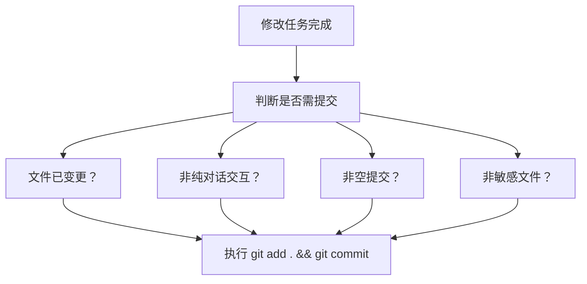

<!-- 创建时间: 2026-06-22 01:28 -->
<!-- 最后修改: 2026-06-22 01:28 -->

# 结果蓝图：自动提交规则增强

## ① 需求分析Agent产出 — 规则修改需求终态

### 完整规则列表
| 规则项 | 值 |
|-------|-----|
| 规则名称 | 修改任务完成后自动提交规则 |
| 触发条件 | 任何修改任务（文件修改/代码编写/文档更新）完成后 |
| 执行动作 | `git add . && git commit -m "类型(范围): 描述"` |
| 适用范围 | 所有阶段（结果先行定义/计划拆分/覆盖核查/子计划执行/子计划核查/终态校验） |
| 与现有规则关系 | 作为现有"每次回复结束后自动提交"的补充，聚焦于"任务完成"这一触发点 |

### 规则定义细节
| 类别 | 需求描述 | 验收标准 |
|------|---------|---------|
| 触发时机 | 每次修改任务（新增/修改文件或代码）完成后 | 任一次文件修改后自动触发提交，不遗漏任何变更 |
| 提交信息 | 遵循Conventional Commits格式 | 格式为 `类型(范围): 描述`，如 `feat(api): add user login endpoint` |
| 冲突处理 | 不与其他自动提交规则冲突 | 多次触发不会导致重复提交或空提交 |
| 可追溯性 | 每次提交能清晰追溯对应任务 | 提交信息中包含任务标识或描述 |

### 执行角色与职责
| 角色 | 可执行操作 | 责任 |
|------|-----------|------|
| PM Agent | 触发自动提交 | 确保每次修改任务完成后执行提交 |
| 核查Agent | 检查提交是否执行 | 在核查报告中检查提交记录 |
| 稽查Agent | 验证提交合规 | 检查提交信息格式和时机 |

---

## ② 架构设计Agent产出 — 规则在文件体系中的位置

### 架构图


**Mermaid源码**：


### 文件位置
| 文件 | 规则角色 | 修改方式 |
|------|---------|---------|
| AGENTS.md | 主规则定义（在"Git 自动提交规则"章节补充） | 新增子规则段落 |
| agent-doc/workflow-status.md | 提交状态记录 | 每次提交后更新 |
| .gitignore | 防止提交敏感文件 | 检查已有配置 |

### 规则层级关系
```
AGENTS.md 主流程规则
  └── Git 自动提交规则（所有阶段适用）
       ├── 规则A：每次回复结束后自动提交（已有）
       ├── 规则B：每完成3个子计划自动提交（已有）
       └── 规则C：每次修改任务完成后自动提交（新增）
```

---

## ③ 功能设计Agent产出 — 自动提交规则的完整行为定义

### 触发流程图
```
+---------------------------+
|  修改任务执行             |
|  (改文件/写代码/更新文档) |
+---------------------------+
              |
              v
+---------------------------+
|  任务完成判定             |
|  - 文件保存到本地         |
|  - 代码/文档变更完成      |
+---------------------------+
              |
              v
+---------------------------+
|  触发自动提交             |
|  git add .               |
|  git commit -m "..."     |
+---------------------------+
              |
              v
+---------------------------+
|  有远程仓库?              |
|  → 是: git push          |
|  → 否: 仅commit          |
+---------------------------+
```

### 行为规则列表
| 场景 | 行为 | 补充说明 |
|------|------|---------|
| 修改1个文件后 | 立即提交 | 提交信息含该文件对应内容描述 |
| 修改多个文件（同一任务） | 合并1次提交 | 提交信息概括该任务的完整变更 |
| 纯对话交互（无文件变更） | 不触发 | 遵循现有规则例外 |
| 子计划执行中（3个累计） | 按"每3个子计划"规则提交 | 两规则不冲突，取更具体的规则执行 |
| 修改+回复同时触发 | 执行1次提交（去重） | 避免重复提交相同变更 |

### 任务类型→提交类型映射
| 任务类型 | 提交类型(scope) | 示例 |
|---------|----------------|------|
| 新增功能 | feat(功能名) | feat(auth): add login page |
| 修改功能 | fix(功能名) | fix(cart): fix quantity bug |
| 修改文档 | docs(范围) | docs(workflow): update auto-commit rules |
| 修改规则 | config(规则名) | config(commit): add task-based auto-commit |
| 修改测试 | test(模块名) | test(api): add user endpoint tests |
| 重构 | refactor(模块名) | refactor(db): simplify query logic |
| 子计划执行 | auto: SP-XX to SP-YY | auto: SP-01 to SP-03 子计划完成 |

---

## ④ 技术设计Agent产出 — Git提交实现细节

### 执行命令定义
| 步骤 | 命令 | 说明 |
|------|------|------|
| 1 | `git status --porcelain` | 检查是否有文件变更 |
| 2 | `if ($?) { git add . }` | 有变更则暂存所有文件 |
| 3 | `git commit -m "类型(范围): 描述"` | 执行提交 |
| 4 | `git push` | 如有远程仓库则推送 |

### 错误处理
| 错误场景 | 处理方式 | 输出提示 |
|---------|---------|---------|
| 无文件变更 | 跳过提交，不报错 | 静默跳过 |
| git add 失败（权限问题） | 记录错误，不阻塞后续流程 | 输出错误信息 |
| git commit 失败（hook拒绝） | 记录失败原因，暂停等待人工处理 | 输出hook错误详情 |
| git push 失败（网络问题） | 仅commit，记录push失败 | 输出push失败信息 |

### 提交信息生成规则
| 组件 | 生成方式 | 示例 |
|------|---------|------|
| 类型 | 根据任务类型自动选择 | feat/fix/docs/config/test/refactor/auto |
| 范围 | 根据修改文件所在模块推断 | 文件在src/auth/下 → scope: auth |
| 描述 | 从任务描述或子计划名称提取 | "add login endpoint" |

### 防重复提交检查
```
检查逻辑：
1. git status --porcelain → 无输出 → 跳过提交（无变更）
2. git log -1 --format=%s → 与即将提交的信息相同 → 跳过提交（已提交）
3. 排除 .gitignore 中的文件不被 add
```

---

## ⑤ 交叉维度完整性校验

| 校验方向 | 检查内容 | 结论 |
|---------|---------|------|
| 需求→规则 | 每条需求（触发时机/冲突处理/可追溯性）是否都有对应规则定义 | 通过 |
| 规则→行为 | 每条规则（场景表）是否都有对应行为定义 | 通过 |
| 行为→技术 | 每个行为是否都有对应技术实现（命令/错误处理） | 通过 |
| 技术→全维度 | 每个技术实现是否在需求/规则/行为中均有体现 | 通过 |

## ⑥ 完整性自检（15项）
| 序号 | 检查项 | 结果 |
|------|--------|------|
| 1 | 前端终态：所有规则已列出 | ✅ |
| 2 | 前端终态：所有触发条件已列出 | ✅ |
| 3 | 前端终态：所有提交类型已定义 | ✅ |
| 4 | 前端终态：提交行为流程已明确 | ✅ |
| 5 | 后端终态：所有命令已列出 | ✅ |
| 6 | 后端终态：所有错误处理已定义 | ✅ |
| 7 | 后端终态：处理链路已描述 | ✅ |
| 8 | 数据层终态：无数据层（规则修改，不涉及数据表） | ✅ |
| 9 | 数据层终态：不适用 | ✅ |
| 10 | 数据层终态：不适用 | ✅ |
| 11 | 业务逻辑终态：所有业务规则已列出 | ✅ |
| 12 | 业务逻辑终态：状态流转已定义 | ✅ |
| 13 | 业务逻辑终态：权限已定义（角色→操作） | ✅ |
| 14 | 交叉维度校验已通过 | ✅ |
| 15 | 覆盖矩阵已产出 | ✅ |
| | **所有15项必须全部通过才能提交确认。有❌则补充后再提交。** | **全部通过** |

## ⑦ 覆盖矩阵
### 规则→技术覆盖矩阵
| 规则场景 | 对应技术实现 | 命令/操作 |
|---------|-------------|---------|
| 修改1个文件后立即提交 | git add + git commit | `git add . && git commit -m "..."` |
| 无文件变更 | 跳过提交 | `git status --porcelain` 检查 |
| git add 失败 | 记录错误不阻塞 | try-catch 包裹 |
| git commit 失败 | 暂停等待处理 | 输出错误信息 |
| git push 失败 | 仅commit不push | try-catch 包裹 push |

### 规则→文件覆盖矩阵
| 规则 | 定义位置 | 状态记录位置 |
|-----|---------|-------------|
| 任务完成后自动提交 | AGENTS.md "Git自动提交规则"章节 | workflow-status.md |
| 空提交跳过 | AGENTS.md 同章节 | — |
| 提交类型映射 | AGENTS.md 同章节 | — |
