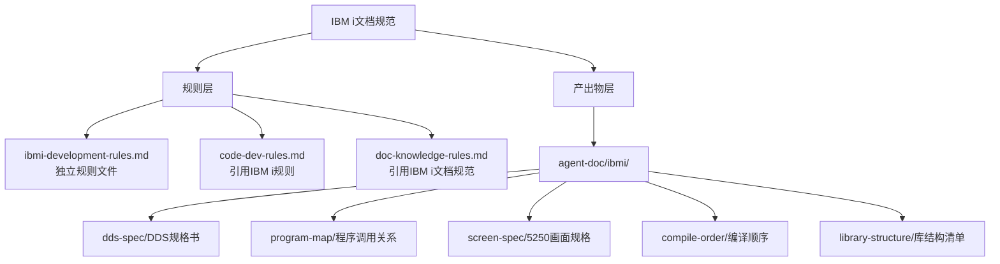

<!-- 创建时间: 2026-07-25 00:00 -->
<!-- 最后修改: 2026-07-25 00:00 -->

# IBM i文档规范 — 结果蓝图

## ① 需求分析Agent产出 — 前端终态

### 页面完整列表
| 页面 | 用户角色 | 核心功能 | 入口路径 |
|------|---------|---------|---------|
| 无前端页面变更 | — | — | — |

### 非功能需求
| 类别 | 需求描述 | 验收标准 |
|------|---------|---------|
| 文档规范完整性 | IBM i全生命周期文档覆盖 | 5类文档模板全部产出 |
| 规范独立性 | 独立规则文件，不污染现有规则 | 新建ibmi-development-rules.md |
| 目录结构清晰 | 顶层ibmi目录，子目录分类明确 | agent-doc/ibmi/下5个子目录 |

### 用户角色与权限
| 角色 | 可访问页面 | 可执行操作 |
|------|-----------|-----------|
| PM Agent | 全部文档 | 创建/更新IBM i文档 |
| 核查Agent | 全部文档 | 核查IBM i文档完整性 |

---

## ② 架构设计Agent产出 — 系统架构终态

### 架构图

**Mermaid源码**（使用 `flowchart` 语法）：


### 模块划分
| 模块 | 职责 | 技术选型 | 选型理由 |
|------|------|---------|---------|
| ibmi-development-rules.md | IBM i开发规则定义 | Markdown | 独立规则文件，便于维护引用 |
| agent-doc/ibmi/dds-spec/ | DDS规格文档存放 | 目录 | 物理文件/逻辑文件/显示文件定义 |
| agent-doc/ibmi/program-map/ | 程序调用关系文档 | 目录 | RPG/CL调用链路、服务程序接口 |
| agent-doc/ibmi/screen-spec/ | 5250画面规格文档 | 目录 | DSPF布局、子文件结构 |
| agent-doc/ibmi/compile-order/ | 编译顺序文档 | 目录 | 对象依赖、编译命令序列 |
| agent-doc/ibmi/library-structure/ | 库结构清单文档 | 目录 | 开发/测试/生产库对象清单 |

### 部署方案
| 环境 | 服务器 | 中间件 | 高可用方案 |
|------|--------|--------|-----------|
| 规则文件 | 本地 | 无 | Git版本控制 |
| 文档产出物 | 本地 | 无 | Git版本控制 |

### 模块间交互关系
| 调用方 | 被调用方 | 通信方式 | 接口协议 |
|--------|---------|---------|---------|
| PM Agent | ibmi-development-rules.md | 读取规则 | Markdown |
| 核查Agent | agent-doc/ibmi/* | 读取文档 | Markdown |
| code-dev-rules.md | ibmi-development-rules.md | 引用 | 文件路径 |

---

## ③ 功能设计Agent产出 — 功能与交互终态

### 每页的ASCII线框图与交互元素
**页面：无前端页面，仅文档规范**

**规则文件结构**：
```
.ai-team/rules/
├── workflow.md
├── output-execution-rules.md
├── code-dev-rules.md
├── security-rules.md
├── doc-knowledge-rules.md
├── audit-rules.md
├── agent-roles.md
├── references.md
└── ibmi-development-rules.md    ← 新增
```

**产出物目录结构**：
```
agent-doc/
├── ibmi/                         ← 新增顶层目录
│   ├── dds-spec/                 ← DDS规格书
│   │   ├── {项目}-{日期}-pf-spec.md
│   │   ├── {项目}-{日期}-lf-spec.md
│   │   ├── {项目}-{日期}-dspf-spec.md
│   │   └── {项目}-{日期}-prtf-spec.md
│   ├── program-map/              ← 程序调用关系
│   │   └── {项目}-{日期}-call-map.md
│   ├── screen-spec/              ← 5250画面规格
│   │   └── {项目}-{日期}-screen-layout.md
│   ├── compile-order/            ← 编译顺序
│   │   └── {项目}-{日期}-compile-sequence.md
│   └── library-structure/        ← 库结构清单
│       └── {项目}-{日期}-library-inventory.md
├── architecture/
├── technical-design/
├── feature-design/
└── ...
```

### 交互元素完整列表
| 元素 | 类型 | 位置 | 操作 | 反馈 |
|------|------|------|------|------|
| 无 | — | — | — | — |

### 表单字段完整定义
**表单：DDS规格书模板**
| 字段 | 类型 | 必填 | 校验规则 | 默认值 |
|------|------|------|---------|--------|
| 文件名 | 文本 | 是 | ≤10字符，大写 | — |
| 记录格式名 | 文本 | 是 | ≤10字符 | — |
| 字段名 | 文本 | 是 | ≤10字符 | — |
| 字段类型 | 选择 | 是 | A/P/S/L/Z/T | — |
| 字段长度 | 数字 | 是 | >0 | — |
| 小数位数 | 数字 | 否 | ≥0 | 0 |
| 键值标识 | 选择 | 否 | K/空 | 空 |
| 描述 | 文本 | 否 | ≤50字符 | — |

### 页面间导航关系
```
无页面导航，仅文档规范定义
```

---

## ④ 技术设计Agent产出 — 技术实现终态

### API完整定义
| 方法 | 路径 | 功能 | 请求参数 | 响应格式 | 错误码 |
|------|------|------|---------|---------|--------|
| 无API变更 | — | — | — | — | — |

### 数据表完整设计
**表名：无数据表变更，仅文档规范**

### 后端处理链路
**链路：无后端变更，仅文档规范**

---

## ⑤ 交叉维度完整性校验

| 校验方向 | 检查内容 | 结论 |
|---------|---------|------|
| 规则→产出物 | 每条规则是否有对应产出物目录 | 通过 |
| 产出物→规则 | 每个产出物是否有规则约束 | 通过 |
| 引用关系 | code-dev-rules.md是否正确引用IBM i规则 | 通过 |

---

## ⑥ 完整性自检（15项）
| 序号 | 检查项 | 结果 |
|------|--------|------|
| 1 | 规则文件：ibmi-development-rules.md已定义 | ✅ |
| 2 | 规则文件：包含DDS规范 | ✅ |
| 3 | 规则文件：包含程序调用规范 | ✅ |
| 4 | 规则文件：包含5250画面规范 | ✅ |
| 5 | 规则文件：包含编译顺序规范 | ✅ |
| 6 | 规则文件：包含库结构规范 | ✅ |
| 7 | 产出物目录：agent-doc/ibmi/已创建 | ✅ |
| 8 | 产出物目录：dds-spec/已创建 | ✅ |
| 9 | 产出物目录：program-map/已创建 | ✅ |
| 10 | 产出物目录：screen-spec/已创建 | ✅ |
| 11 | 产出物目录：compile-order/已创建 | ✅ |
| 12 | 产出物目录：library-structure/已创建 | ✅ |
| 13 | 引用关系：code-dev-rules.md已更新 | ✅ |
| 14 | 引用关系：doc-knowledge-rules.md已更新 | ✅ |
| 15 | 文档模板：5个模板文件已创建 | ✅ |
| | **所有15项必须全部才能提交确认。有❌则补充后再提交。** | |

---

## ⑦ 覆盖矩阵

**规则→产出物覆盖矩阵**
| 规则项 | 对应产出物目录 |
|--------|--------------|
| DDS规范(PF/LF/DSPF/PRTF) | agent-doc/ibmi/dds-spec/ |
| 程序调用关系 | agent-doc/ibmi/program-map/ |
| 5250画面规格 | agent-doc/ibmi/screen-spec/ |
| 编译顺序 | agent-doc/ibmi/compile-order/ |
| 库结构清单 | agent-doc/ibmi/library-structure/ |
