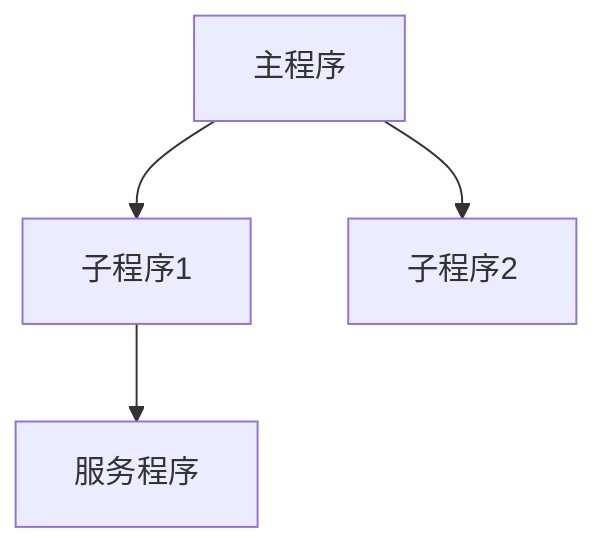

<!-- 创建时间: 2026-07-25 00:00 -->
<!-- 最后修改: 2026-07-25 00:00 -->

# IBM i文档规范 — 技术设计文档

## 1. 技术概述

本文档定义IBM i项目文档规范的技术实现细节，包括规则文件格式、文档模板结构和命名规范。

## 2. 规则文件技术规范

### 2.1 ibmi-development-rules.md 文件结构

```markdown
<!-- 创建时间: yyyy-MM-dd HH:mm -->
<!-- 最后修改: yyyy-MM-dd HH:mm -->

# IBM i开发规则

---

## 1. DDS规范

### 1.1 物理文件(PF)规范
| # | 规则 | 约束 |
|---|------|------|
| 1 | 字段名长度 | ≤10字符 |
| 2 | 必须有键 | 每个PF必须定义主键 |
| 3 | 日期字段类型 | 使用L类型(ISO日期) |
| 4 | 金额字段类型 | 使用P(压缩十进制) |

### 1.2 逻辑文件(LF)规范
| # | 规则 | 约束 |
|---|------|------|
| 1 | 基于PF | 必须引用PF的记录格式 |
| 2 | 键值定义 | 使用PF中已定义的字段 |
| 3 | 选择条件 | 使用SELECT/OMIT |

### 1.3 显示文件(DSPF)规范
| # | 规则 | 约束 |
|---|------|------|
| 1 | 使用消息子文件 | 消息显示统一使用SFLMSG模式 |
| 2 | 功能键使用CF | CF允许程序读取功能键AID |
| 3 | 字段使用类型标注 | B-输入输出, I-仅输入, O-仅输出, H-隐藏 |

### 1.4 打印文件(PRTF)规范
| # | 规则 | 约束 |
|---|------|------|
| 1 | 页眉定义 | 使用HEAD1/HEAD2 |
| 2 | 详情行定义 | 使用DETAIL |
| 3 | 页脚定义 | 使用FOOT1/FOOT2 |

## 2. 程序调用规范

### 2.1 RPG程序规范
| # | 规则 | 约束 |
|---|------|------|
| 1 | 使用自由格式 | **FREE开头，禁止固定格式 |
| 2 | 错误处理 | Monitor/On-Error |
| 3 | 原型声明 | 外部调用必须声明Dcl-Pr |
| 4 | 服务程序引用 | 通过绑定目录引用 |

### 2.2 CL程序规范
| # | 规则 | 约束 |
|---|------|------|
| 1 | 变量声明 | 所有变量必须先DCL再使用 |
| 2 | 错误捕获 | 每个可能出错的命令后加MONMSG |
| 3 | 库名处理 | 使用RTVJOBA获取当前库，禁止硬编码 |

## 3. 5250画面规范

### 3.1 画面布局规范
| # | 规则 | 约束 |
|---|------|------|
| 1 | 布局顺序 | 标题→输入区→明细区→功能键提示→消息区 |
| 2 | 子文件结构 | SFL+SFLCTL+SFLMSG三件套 |
| 3 | 功能键定义 | F3=退出, F5=刷新, F12=返回 |

### 3.2 子文件规范
| # | 规则 | 约束 |
|---|------|------|
| 1 | SFLSIZ | 子文件总行数 |
| 2 | SFLPAG | 每页显示行数 |
| 3 | SFLRCDNBR | 当前记录号 |

## 4. 编译顺序规范

### 4.1 编译依赖关系
| 对象类型 | 依赖 | 编译命令 |
|---------|------|---------|
| PF | 无 | CRTPF |
| LF | PF | CRTLF |
| DSPF | 无 | CRTDSPF |
| MODULE | 无 | CRTRPGMOD |
| SRVPGM | MODULE | CRTSRVPGM |
| PGM | MODULE/SRVPGM | CRTBNDRPG |

### 4.2 编译顺序规则
| # | 规则 | 约束 |
|---|------|------|
| 1 | 先编译文件 | PF→LF→DSPF/PRTF |
| 2 | 再编译模块 | RPGMOD/CLMOD |
| 3 | 创建服务程序 | CRTSRVPGM |
| 4 | 最后编译程序 | CRTBNDRPG |

## 5. 库结构规范

### 5.1 库命名规范
| 环境 | 库名格式 | 示例 |
|------|---------|------|
| 开发 | DEV{应用名} | DEVAPP |
| 测试 | TST{应用名} | TSTAPP |
| 生产 | PRD{应用名} | PRDAPP |

### 5.2 源文件规范
| 源文件名 | 存放的Source Type | 说明 |
|----------|-------------------|------|
| QRPGLESRC | RPGLE, RPGMOD, SQLRPGLE | RPG源码 |
| QCLLESRC | CLLE, CLMOD | ILE CL源码 |
| QDDSSRC | PF, LF, DSPF, PRTF | DDS源码 |
| QCMDSRC | CMD | 命令定义源码 |
| QSRVSRC | BND | Binder Language源码 |
```

## 3. 文档模板技术规范

### 3.1 DDS规格书模板

```markdown
<!-- 创建时间: yyyy-MM-dd HH:mm -->
<!-- 最后修改: yyyy-MM-dd HH:mm -->

# {项目名} — DDS规格书

## 1. 物理文件(PF)规格

### 1.1 {文件名}
| 字段名 | 类型 | 长度 | 小数位 | 键值 | 描述 |
|--------|------|------|--------|------|------|
| {字段} | {A/P/L} | {长度} | {小数} | {K/空} | {描述} |

**记录格式名**: {格式名}
**键值**: {键字段列表}
```

### 3.2 程序调用关系模板

```markdown
<!-- 创建时间: yyyy-MM-dd HH:mm -->
<!-- 最后修改: yyyy-MM-dd HH:mm -->

# {项目名} — 程序调用关系

## 1. 调用关系图



## 2. 程序清单

| 程序名 | 类型 | 功能 | 调用程序 | 被调用程序 |
|--------|------|------|---------|-----------|
| {程序} | {RPG/CL} | {功能} | {调用者} | {被调用者} |

## 3. 服务程序接口

| 服务程序 | 导出过程 | 参数 | 返回值 |
|---------|---------|------|--------|
| {SRVPGM} | {过程} | {参数} | {返回} |
```

### 3.3 5250画面规格模板

```markdown
<!-- 创建时间: yyyy-MM-dd HH:mm -->
<!-- 最后修改: yyyy-MM-dd HH:mm -->

# {项目名} — 5250画面规格

## 1. 画面清单

| 画面名 | 功能 | 功能键 | 子文件 |
|--------|------|--------|--------|
| {DSPF} | {功能} | {F3/F5/F12} | {SFL名称} |

## 2. 画面布局

### 2.1 {画面名}
```
+------------------------------------------+
| {标题}                              [用户] |
+------------------------------------------+
|                                            |
|  [输入区]                                  |
|  +--------------------------------------+ |
|  | {字段列表}                            | |
|  +--------------------------------------+ |
|                                            |
|  [明细区]                                  |
|  +--------------------------------------+ |
|  | {子文件字段}                          | |
|  +--------------------------------------+ |
|                                            |
+------------------------------------------+
| F3=退出 F5=刷新 F12=返回                   |
+------------------------------------------+
```

## 3. 子文件规格

| 子文件名 | 字段 | 每页行数 | 总行数 | 功能 |
|---------|------|---------|--------|------|
| {SFL} | {字段} | {SFLPAG} | {SFLSIZ} | {功能} |
```

### 3.4 编译顺序模板

```markdown
<!-- 创建时间: yyyy-MM-dd HH:mm -->
<!-- 最后修改: yyyy-MM-dd HH:mm -->

# {项目名} — 编译顺序

## 1. 编译清单

| 顺序 | 对象类型 | 对象名 | 编译命令 | 依赖 |
|------|---------|--------|---------|------|
| 1 | PF | {文件名} | CRTPF | 无 |
| 2 | LF | {文件名} | CRTLF | PF |
| 3 | DSPF | {文件名} | CRTDSPF | 无 |
| 4 | MODULE | {模块名} | CRTRPGMOD | 无 |
| 5 | SRVPGM | {服务程序} | CRTSRVPGM | MODULE |
| 6 | PGM | {程序名} | CRTBNDRPG | MODULE/SRVPGM |

## 2. 编译命令

```cl
/* 顺序1: 编译PF */
CRTPF FILE(mylib/CUSTPF) SRCFILE(mylib/QDDSSRC) SRCMBR(CUSTPF)

/* 顺序2: 编译LF */
CRTLF FILE(mylib/CUSTPFL1) SRCFILE(mylib/QDDSSRC) SRCMBR(CUSTPFL1)

/* 顺序3: 编译DSPF */
CRTDSPF FILE(mylib/ORDDSPF) SRCFILE(mylib/QDDSSRC) SRCMBR(ORDDSPF)

/* 顺序4: 编译模块 */
CRTRPGMOD MODULE(mylib/ORDMOD) SRCFILE(mylib/QRPGLESRC) SRCMBR(ORDMOD)

/* 顺序5: 创建服务程序 */
CRTSRVPGM SRVPGM(mylib/CUSTSRV) MODULE(mylib/CUSTSRV) SRCFILE(mylib/QSRVSRC) SRCMBR(CUSTSRV)

/* 顺序6: 编译程序 */
CRTBNDRPG PGM(mylib/ORDADD) SRCFILE(mylib/QRPGLESRC) SRCMBR(ORDADD) BNDDIR(mylib/STDBND)
```
```

### 3.5 库结构清单模板

```markdown
<!-- 创建时间: yyyy-MM-dd HH:mm -->
<!-- 最后修改: yyyy-MM-dd HH:mm -->

# {项目名} — 库结构清单

## 1. 环境配置

| 环境 | 库名 | 服务器 | 用途 |
|------|------|--------|------|
| 开发 | DEVAPP | {服务器} | 开发环境 |
| 测试 | TSTAPP | {服务器} | 测试环境 |
| 生产 | PRDAPP | {服务器} | 生产环境 |

## 2. 源文件清单

| 库名 | 源文件名 | Source Type | 说明 |
|------|---------|-------------|------|
| DEVAPP | QRPGLESRC | RPGLE/SQLRPGLE | RPG源码 |
| DEVAPP | QCLLESRC | CLLE/CLMOD | CL源码 |
| DEVAPP | QDDSSRC | PF/LF/DSPF/PRTF | DDS源码 |
| DEVAPP | QCMDSRC | CMD | 命令定义 |
| DEVAPP | QSRVSRC | BND | Binder Language |

## 3. 对象清单

| 库名 | 对象名 | 对象类型 | 说明 |
|------|--------|---------|------|
| DEVAPP | CUSTPF | *FILE | 客户主文件 |
| DEVAPP | CUSTPFL1 | *FILE | 客户逻辑文件 |
| DEVAPP | ORDADD | *PGM | 订单添加程序 |
| DEVAPP | CUSTSRV | *SRVPGM | 客户服务程序 |
```

## 4. 命名规范

### 4.1 文件命名规范

| 文档类型 | 命名格式 | 示例 |
|---------|---------|------|
| DDS规格书 | {项目}-{日期}-pf-spec.md | myproject-20260725-pf-spec.md |
| 程序调用关系 | {项目}-{日期}-call-map.md | myproject-20260725-call-map.md |
| 5250画面规格 | {项目}-{日期}-screen-layout.md | myproject-20260725-screen-layout.md |
| 编译顺序 | {项目}-{日期}-compile-sequence.md | myproject-20260725-compile-sequence.md |
| 库结构清单 | {项目}-{日期}-library-inventory.md | myproject-20260725-library-inventory.md |

### 4.2 目录命名规范

| 目录 | 用途 |
|------|------|
| agent-doc/ibmi/ | IBM i文档根目录 |
| agent-doc/ibmi/dds-spec/ | DDS规格书 |
| agent-doc/ibmi/program-map/ | 程序调用关系 |
| agent-doc/ibmi/screen-spec/ | 5250画面规格 |
| agent-doc/ibmi/compile-order/ | 编译顺序 |
| agent-doc/ibmi/library-structure/ | 库结构清单 |
